附加游戏后下断点 bp ws2_32.send

send函数断下后，可以看到数据地址每次都一样

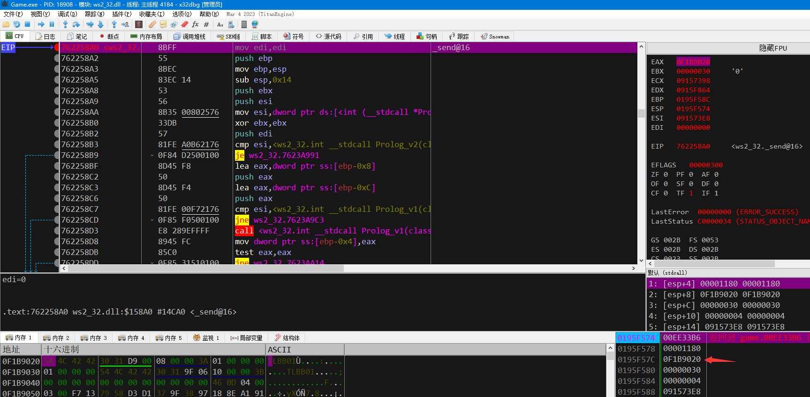

可以说明这个游戏是线程发包，所以直接在数据窗口中转到这个地址，然后对这个地址下硬件写入断点。

下了硬件写入断点后可以一层一层往上面跟，确定写包的CALL，但是由于这个游戏发包异常的频繁，这种方式跟的话费时费力，所以采取第二种办法：

下硬件断点断下来后看调用堆栈，多观察几个包的调用堆栈，一般来讲都有一个公共的写包函数，只要找到这个写包函数，再往上面跳就是各个功能了。

我这里地址是f1b9020 所以我执行命令dump f1b9020跳转到这个地址来：

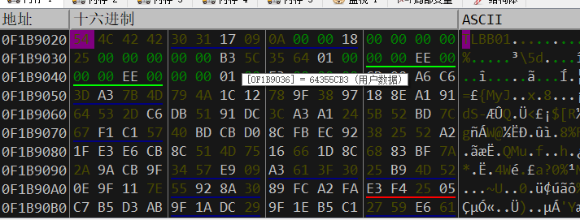

接下来下硬件写入断点观察：

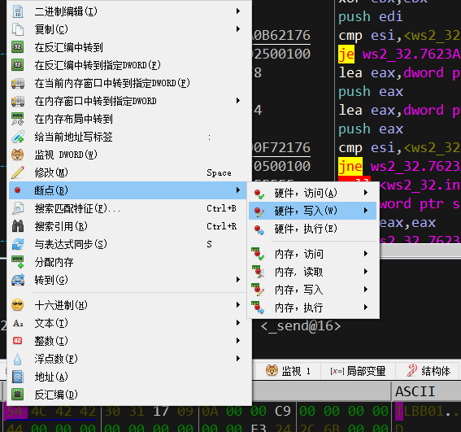

几次断下来后堆栈如下：

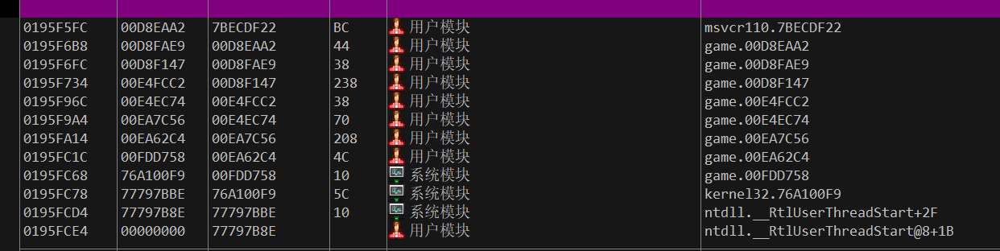

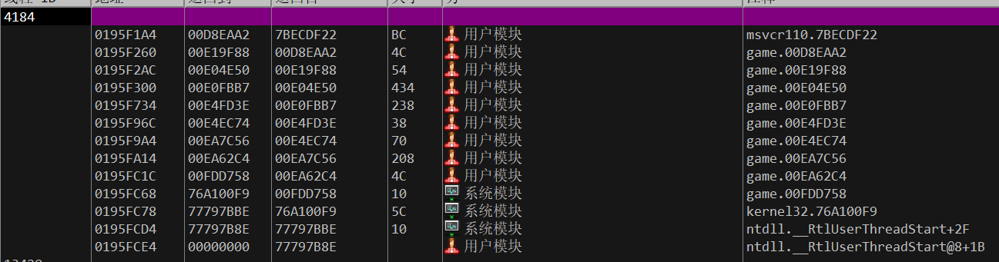

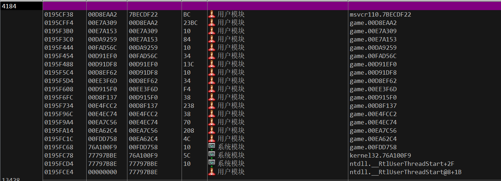

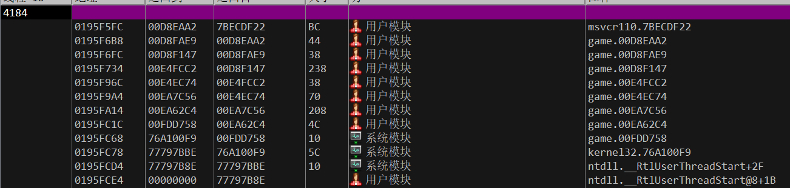

观察了几个包 只有00D8EAA2值公共调用，说明这个包很有可能就是写包函数

转到00D8EAA2这个地址，注意，这个地址是返回到了这个地址的意思，也就是说call是在这个地址上面一行。

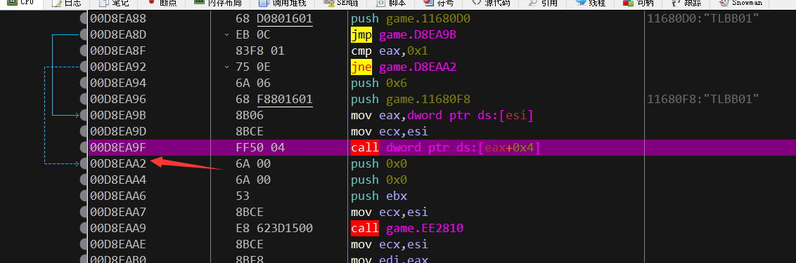

在00d8ea9f处下断发现一直断 说明这个游戏在不断的发包，所以需要下条件断点过滤我们不必要的包，比如心跳包

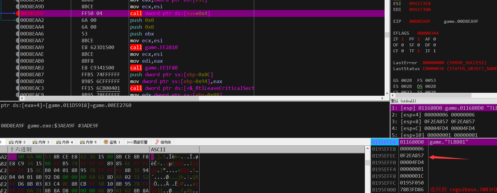

经过几次观察发现唯一的规律就是 [esp+8]的值会变，我们过滤掉几个不是我们动作产生的包 断点条件如下：

[esp+8]!= 0f2eae7b&&[esp+8]!= 0f2eaabb 下好条件断点后去游戏选怪

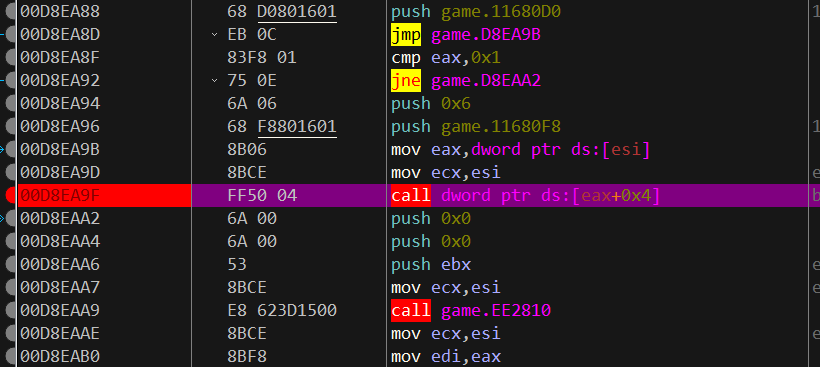

断下来后返回到上一层 给这个call下段 

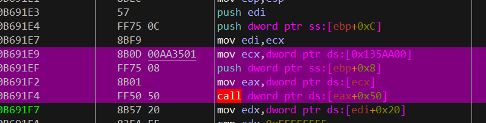

然后再返回到上一层 给这个call下段

 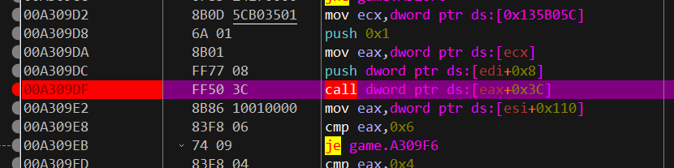

这里不打算返回上一层了。因为看这个call就有点像选怪call的样子。

这里下了一个断点，然后去游戏里面选个怪，看看参数，然后注入试试。

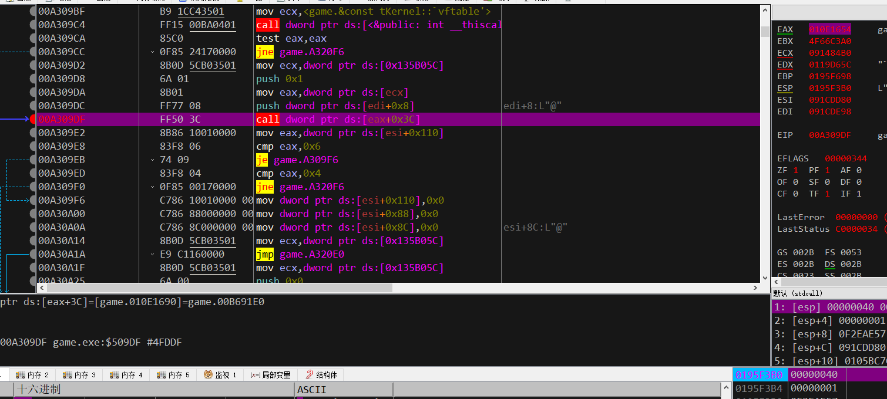

可以看到是有两个参数 第一次参数是41 第二个固定是1 盲猜第一个是怪物的ID，因为我换了几个怪这个参数就在不断的变换。

这里ecx也赋值了，ecx一般是this指针。可以去call里面看一下使用ecx的时候有没有先赋值，如果没有的话ecx就是传的this

所以 选怪的汇编代码如下：

mov ecx,dword ptr ds:[0xBBB05C]

push 0x1

mov eax,dword ptr ds:[ecx]

push 怪物ID

call dword ptr ds:[eax+0x3C]

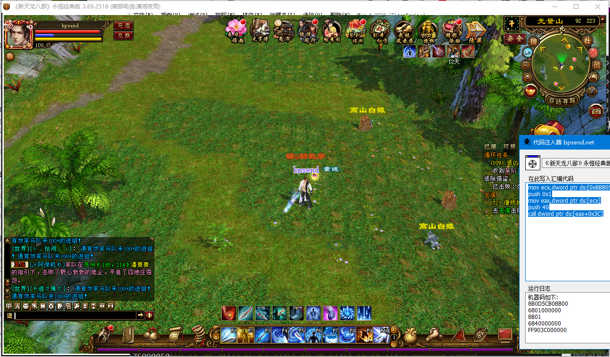

注入之前没有选怪物。

注入后的效果：

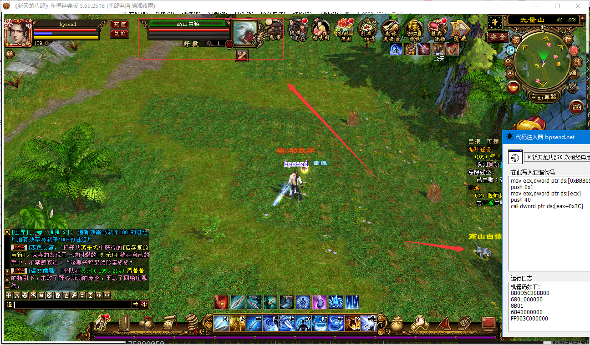

由此可见 已经通过跳出发包的线程找到了选怪CALL