思路：一般游戏中人物血量、蓝、经验等面板中可以看到的一切信息都应该存在一结构体中，为了找到人物信息，现在就以人物血量为突破口

人物面板如下所示：

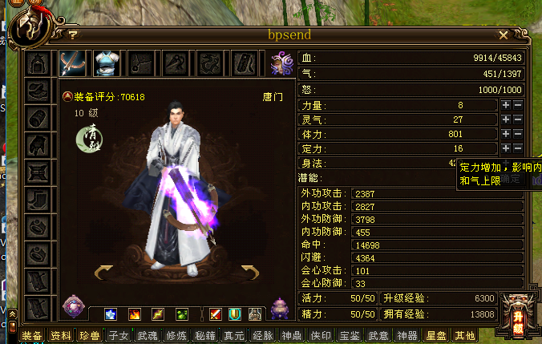

在CE中搜索9914

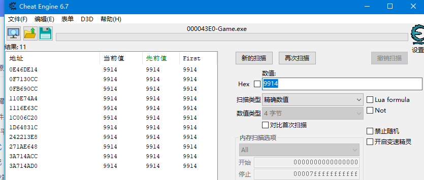

搜出来很多个，没关系，我们尝试一下改变人物的血值，改变人物血值的方式很多，比如吃药、打坐、被怪物攻击等等。这里我选择打坐一把

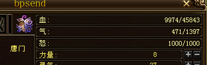

这里已经改变城9974了，我们继续在CE中搜索9974

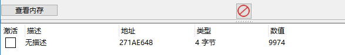

只剩下唯一的值了，我们对这个值下访问断点，然后打坐

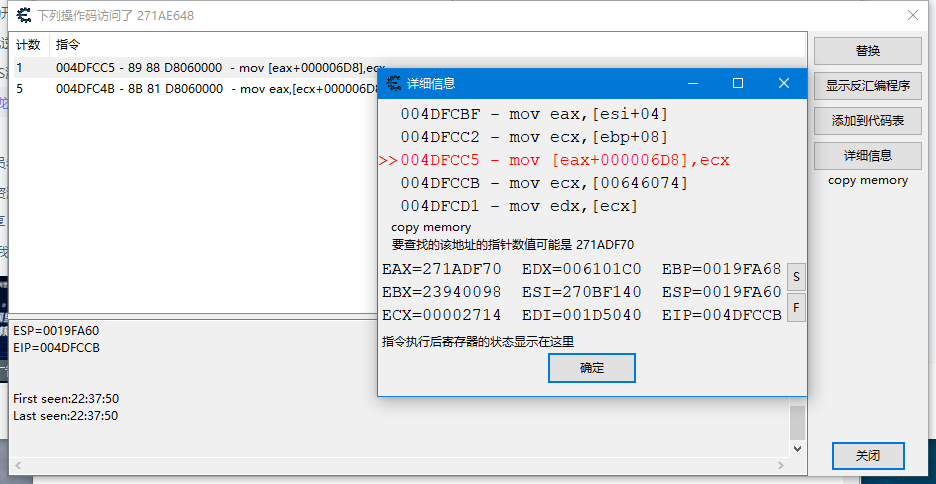

```assembly
Game.exe+DFCC5:
004DFCBF - 8B 46 04  - mov eax,[esi+04]
004DFCC2 - 8B 4D 08  - mov ecx,[ebp+08]
004DFCC5 - 89 88 D8060000  - mov [eax+000006D8],ecx <<
004DFCCB - 8B 0D 74606400  - mov ecx,[Game.exe+246074]
004DFCD1 - 8B 11  - mov edx,[ecx]

EAX=271ADF70
EBX=23940098
ECX=00002714
EDX=006101C0
ESI=270BF140
EDI=001D5040
EBP=0019FA68
ESP=0019FA60
EIP=004DFCCB
```

然后继续搜索271ADF70

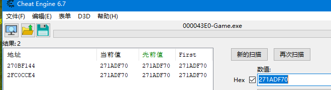

搜出来2个，对这2个地址都下访问断点吧

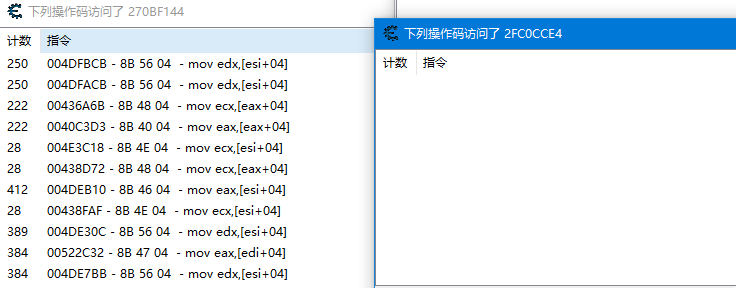

只有其中一个地址有访问，随便找一条看看

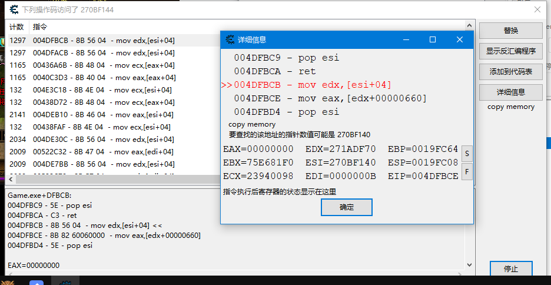

```assembly
Game.exe+DFBCB:
004DFBC9 - 5E - pop esi
004DFBCA - C3 - ret 
004DFBCB - 8B 56 04  - mov edx,[esi+04] <<
004DFBCE - 8B 82 60060000  - mov eax,[edx+00000660]
004DFBD4 - 5E - pop esi

EAX=00000000
EBX=75E681F0
ECX=23940098
EDX=271ADF70
ESI=270BF140
EDI=0000000B
EBP=0019FC64
ESP=0019FC08
EIP=004DFBCE
```

这里我们继续搜索270BF140

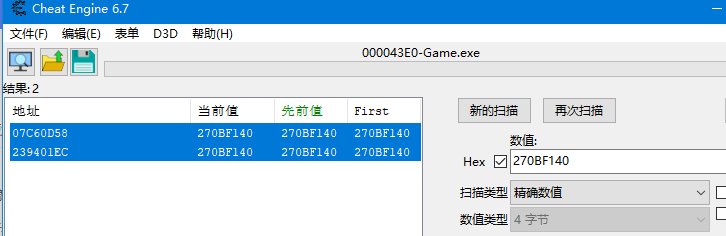

又有2个，继续下访问断点，然后观察

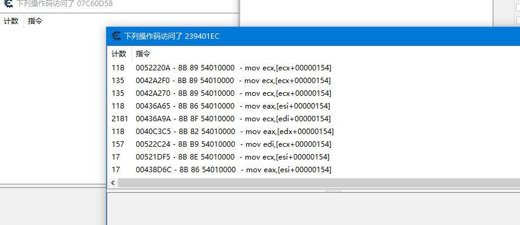

还是只有其中一个有访问代码，随便观察一条

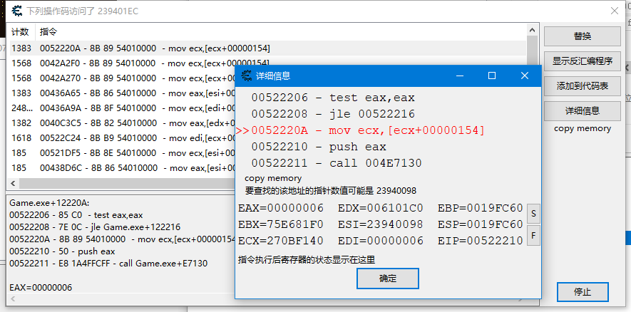

```assembly
Game.exe+12220A:
00522206 - 85 C0  - test eax,eax
00522208 - 7E 0C - jle Game.exe+122216
0052220A - 8B 89 54010000  - mov ecx,[ecx+00000154] <<
00522210 - 50 - push eax
00522211 - E8 1A4FFCFF - call Game.exe+E7130

EAX=00000006
EBX=75E681F0
ECX=270BF140
EDX=006101C0
ESI=23940098
EDI=00000006
EBP=0019FC60
ESP=0019FC60
EIP=00522210
```

按照CE的提示 继续搜索 23940098


这次有7条地址了，都下访问断点试试

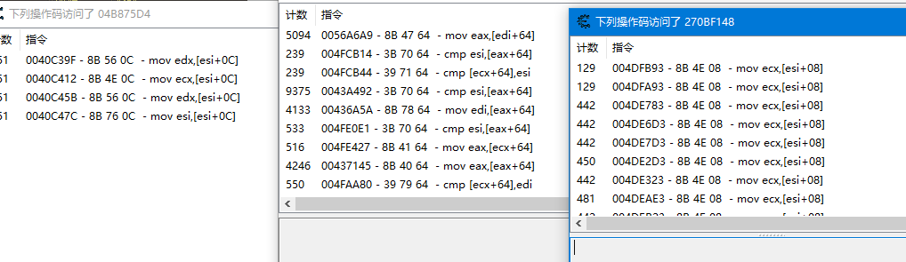

每个偏移都不同，我们从第一条开始分析，如果分析不下去了再分析后面的地址，如果能分析出来后面的就不分析了

第一条：

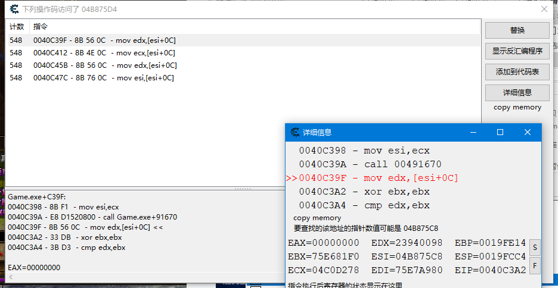

```assembly
Game.exe+C39F:
0040C398 - 8B F1  - mov esi,ecx
0040C39A - E8 D1520800 - call Game.exe+91670
0040C39F - 8B 56 0C  - mov edx,[esi+0C] <<
0040C3A2 - 33 DB  - xor ebx,ebx
0040C3A4 - 3B D3  - cmp edx,ebx
EAX=00000000
EBX=75E681F0
ECX=04C0D278
EDX=23940098
ESI=04B875C8
EDI=75E7A980
EBP=0019FE14
ESP=0019FCC4
EIP=0040C3A2
```

按照CE的提示继续搜04B875C8

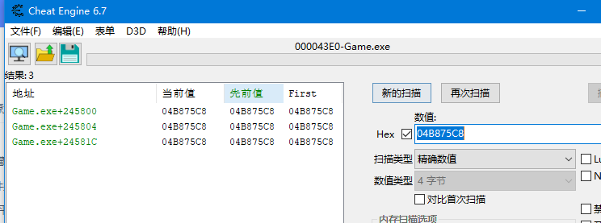

基址已经出来了，后面的应该就不用分析了，我们去调试器里面看看，随便看看附近有没有蓝之类的，如果没有就还要分析其他的地址

在调试器中 dump [[[[00645800]+0c]+154]+4]+6d8

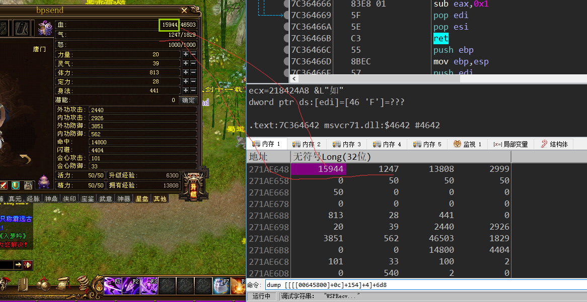

可以看到，在调试器中，人物面板大部分值都出现了

   

人物属性也有，说明这个基址就是人物对象的

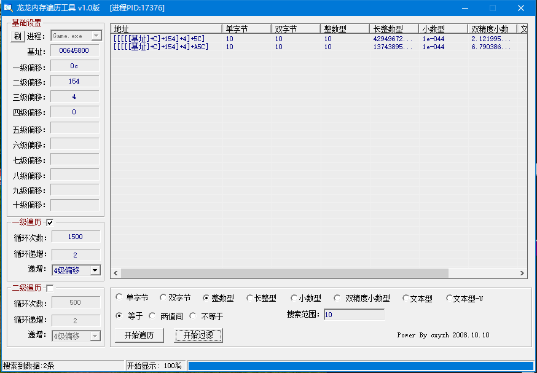

用内存遍历工具找到2个10，目前等级是10级，升级看看

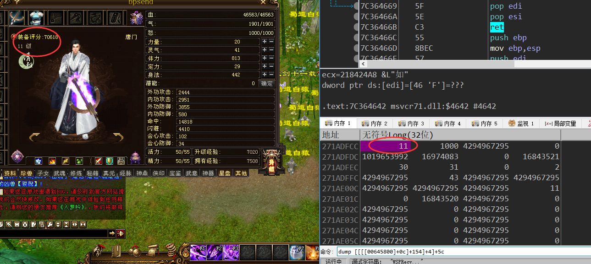

5C的位置应该就是等级了

其他的数据也可以用类似的方法找出来