思路：可以通过比较直观的名字或者物品数量来找到对象地址，找到对象后，再找对象是如何存储的，即可找到背包数组

这里先以通过物品数量来演示

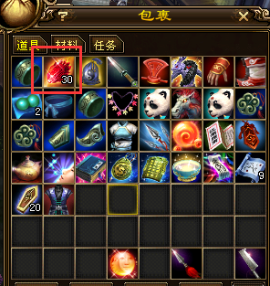

玄兵石的数量是30，先搜30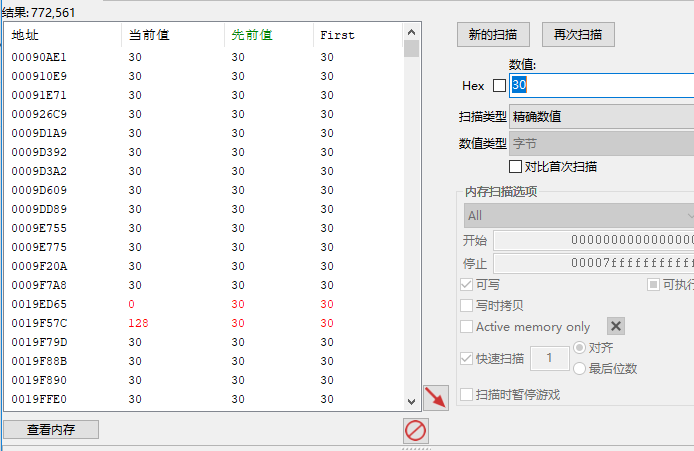

然后拆分一个，再继续搜29，再拆分或者整理，然后继续搜当前数量

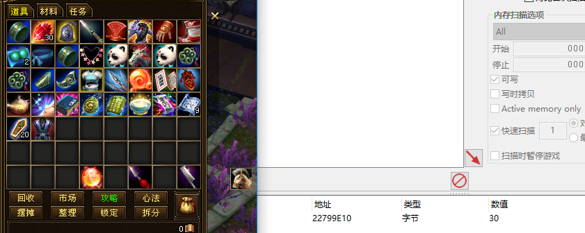

最后得到一个确切的值，对这个值下访问断点

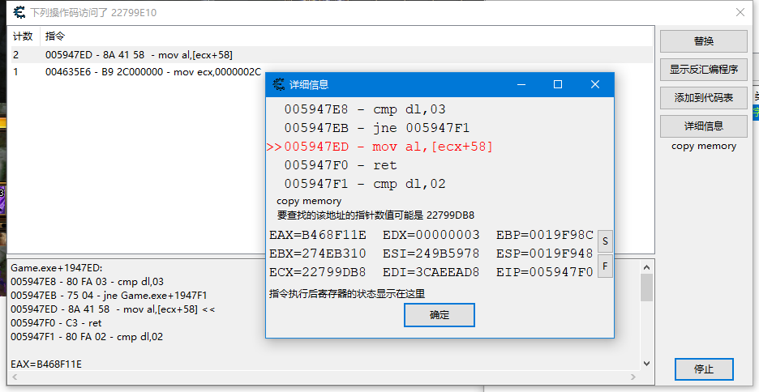

```assembly
Game.exe+1947ED:
005947E8 - 80 FA 03 - cmp dl,03
005947EB - 75 04 - jne Game.exe+1947F1
005947ED - 8A 41 58  - mov al,[ecx+58] <<
005947F0 - C3 - ret
005947F1 - 80 FA 02 - cmp dl,02
```

继续搜索22799DB8

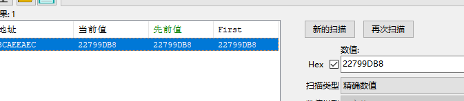

只有一条，对这个地址继续下访问断点

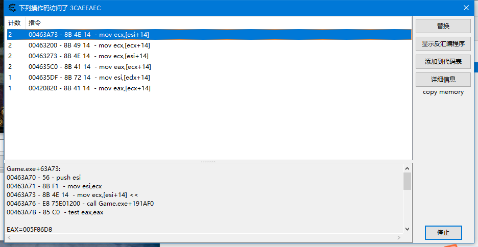

```assembly
Game.exe+63A73:
00463A70 - 56 - push esi
00463A71 - 8B F1  - mov esi,ecx
00463A73 - 8B 4E 14  - mov ecx,[esi+14] <<
00463A76 - E8 75E01200 - call Game.exe+191AF0
00463A7B - 85 C0  - test eax,eax
```

观察了一下，上面几条代码提示的指针都是3CAEEAD8 所以就继续搜这个值吧。

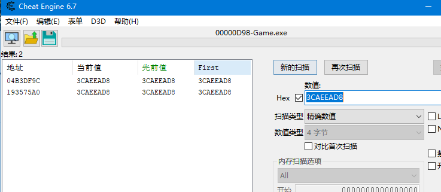

有两个地址，这两个都可以下访问断，看看有什么不同

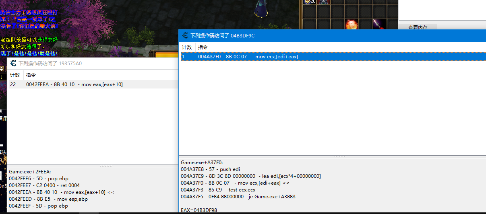

04B3DF9C这个代码只有在我使用物品的时候触发了一次，然而193575A0却不知道在什么情况下触发了几次，而且从代码里面看 edi来源于一个数组，优先找04B3DF9C

```assembly
Game.exe+A37F0:
004A37E8 - 57 - push edi
004A37E9 - 8D 3C 8D 00000000  - lea edi,[ecx*4+00000000]
004A37F0 - 8B 0C 07   - mov ecx,[edi+eax] <<
004A37F3 - 85 C9  - test ecx,ecx
004A37F5 - 0F84 88000000 - je Game.exe+A3883
```

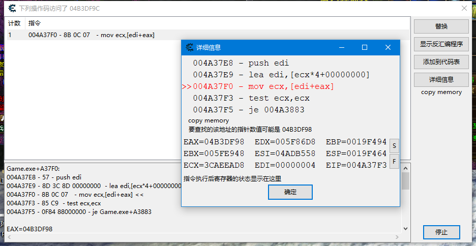

这里继续搜索04B3DF98

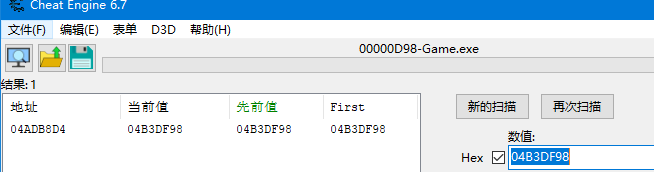

只有一个地址，对这个地址下访问断点

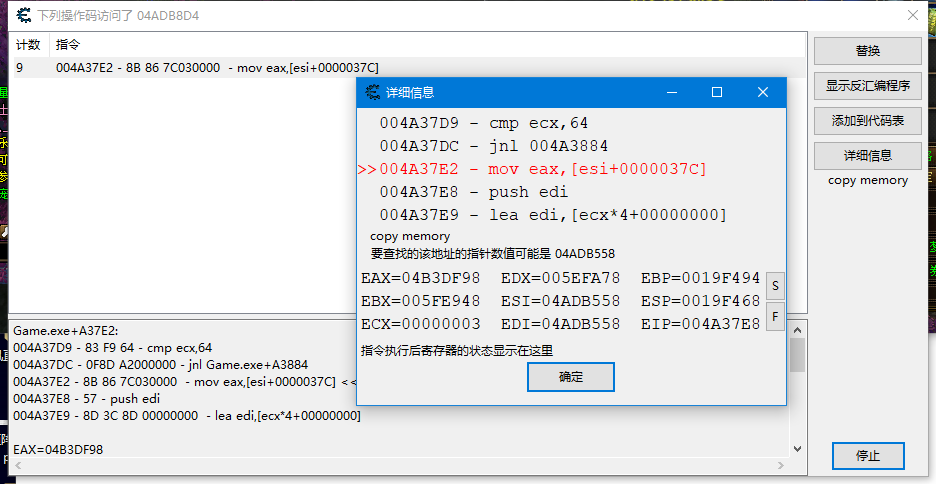

```assembly
Game.exe+A37E2:
004A37D9 - 83 F9 64 - cmp ecx,64
004A37DC - 0F8D A2000000 - jnl Game.exe+A3884
004A37E2 - 8B 86 7C030000  - mov eax,[esi+0000037C] <<
004A37E8 - 57 - push edi
004A37E9 - 8D 3C 8D 00000000  - lea edi,[ecx*4+00000000]
```

继续搜索04ADB558

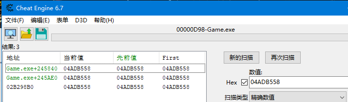

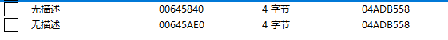

这里有两个基址

随便选一条，我选第二条吧

所以物品数量应当就是[[[[0x00645ae0]+0x37c]+index*4]+0x14]+0x58 去调试器或者CE里面验证一下

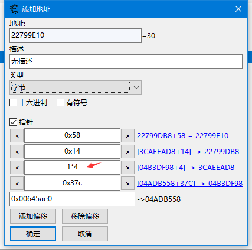

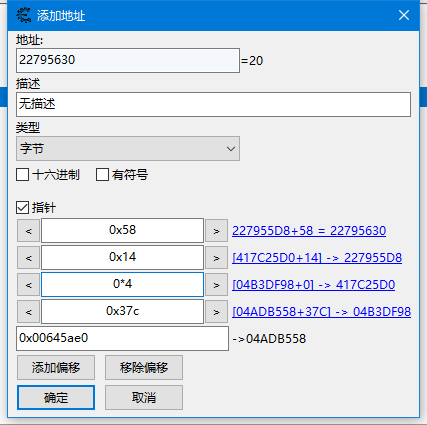


可以看到是OK的，现在找一下名字 如果是非修改版的CE就要用字节转换器才能找到(或者CE7以上的版本搜字符串，把代码页勾上)

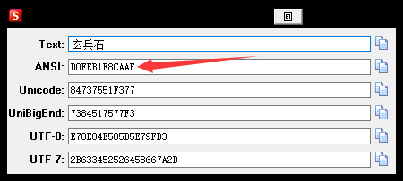

玄兵石的ANSI是：D0FEB1F8CAAF 所以在CE里面搜D0FEB1F8CAAF 类型是字节数组

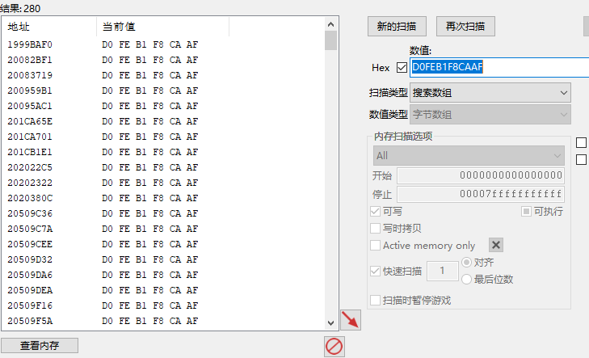

280个。。。都拖下来 然后尝试更改其中一半

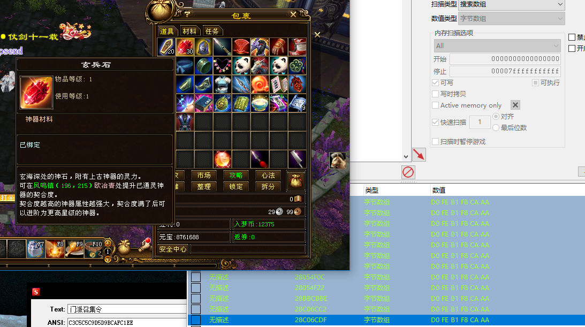

没反应，接着改后面的一半

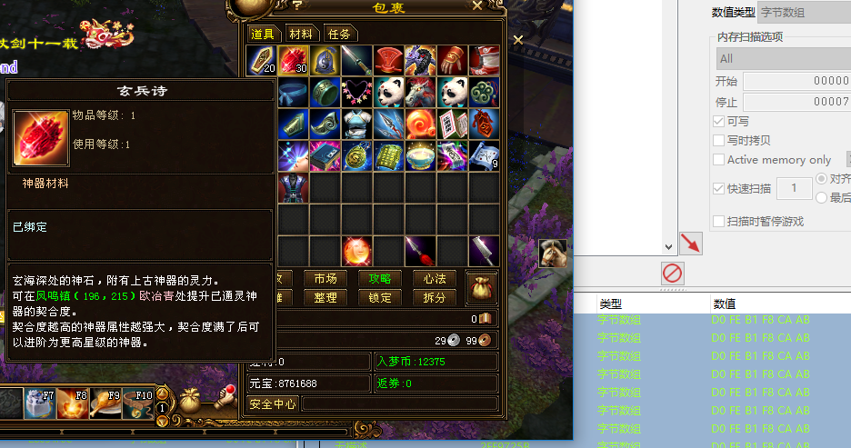

有了反应，接着再继续改确定有存储名字的那一半里面

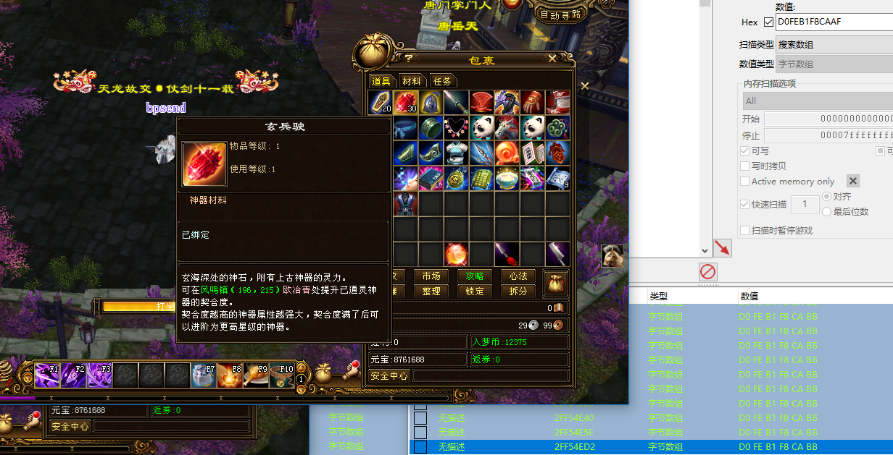

范围又缩小了一半

通过不断的改再观察游戏里面的显示 最终确定一条

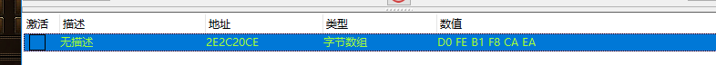

对这个地址下访问断点


都是在str的库函数里面

先分析前面的

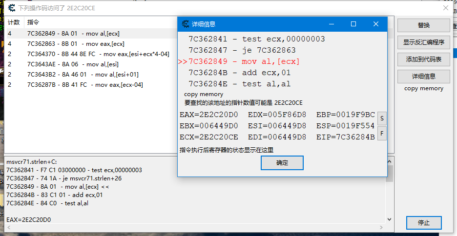

现在搜索 2E2C20CE 


对这几个都下访问断

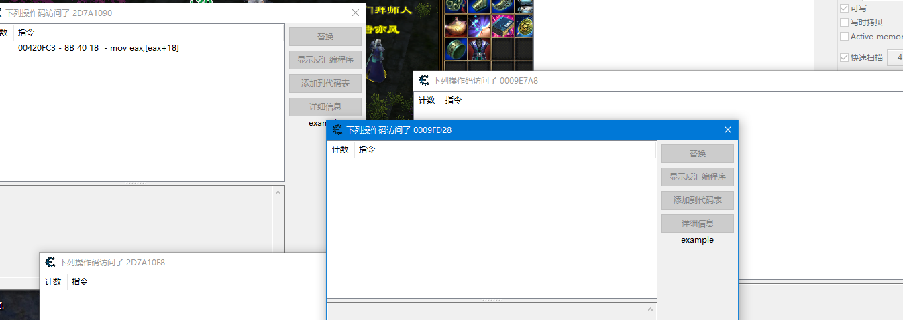

只有2D7A1090 有访问记录

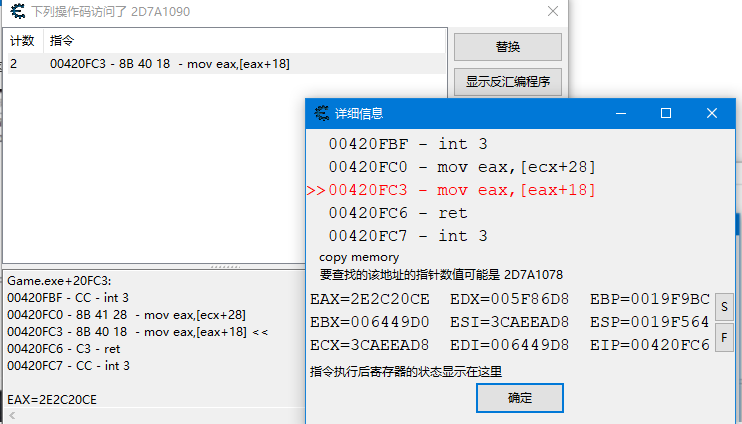

接下来继续搜索2D7A1078

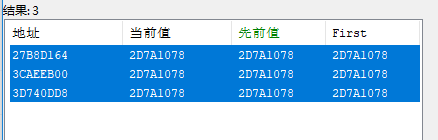

有三条记录，对这3个都下访问断点试试

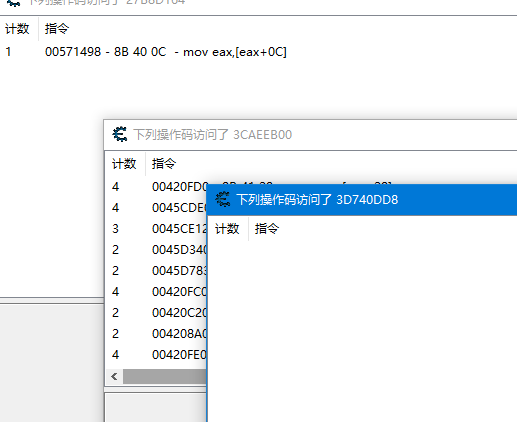

有两个地址有记录

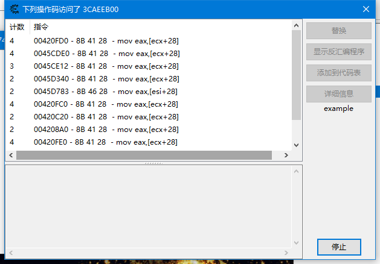

先看这一个吧。

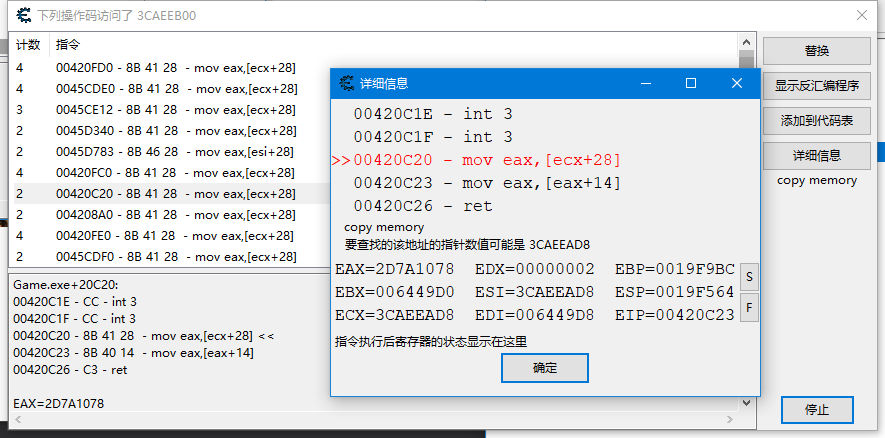

继续搜索 3CAEEAD8 

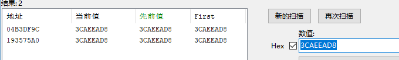

找到2个地址，对这两个地址下访问断点试试

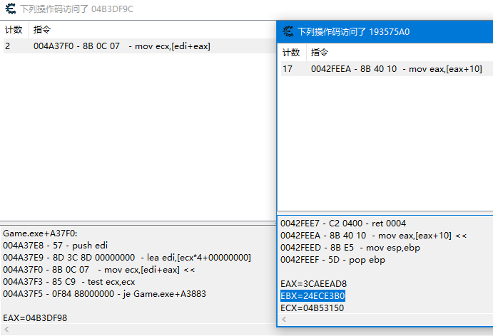

虽然有两个地址，但是已经找到跟之前相同的地方了，就是这个edi+eax这里，所以可以推断出来，名字的位置是

[[[[0x00645ae0]+0x37c]+index*4]+0x28]+0x18

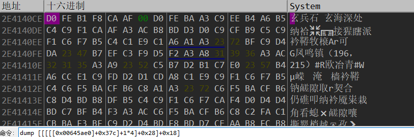

写测试代码遍历的时候发现有的名字在0x18的位置，有的在0x28的位置

[[[[0x00645ae0]+0x37c]+index*4]+0x28]+8这个位置的值如果是 1 2 4的话名字就存在0x28的位置 所以测试代码如下：

```c++
void CMainDlg::OnBnClickedBtnGetbag()
{
    //dump[[0x00645ae0] + 0x37c] + 0 * 4 是数组首地址
    //dump [[[[0x00645ae0]+0x37c]+0*4]+0x14]物品对象 物品对象+58是数量，为1字节无符号整数字
    __try
    {
        DWORD dwArrBase = ReadGaemMem<DWORD>(0x00645ae0);
        dwArrBase = ReadGaemMem<DWORD>(dwArrBase + 0x37c);
        for (int i = 0; i < 100; i++)
        {
            DWORD dwObj = ReadGaemMem<DWORD>(dwArrBase + i * 4);
            DWORD dwItem = ReadGaemMem<DWORD>(dwObj + 0x14);
            if (dwItem == 0)
            {
                continue;
            }
            DWORD dwInfo = ReadGaemMem<DWORD>(dwObj + 0x28);
            DWORD dwType = ReadGaemMem<DWORD>(dwInfo + 0x8);
            DWORD dwOffset = 0x18;
            char *szName = nullptr;
            if (dwType == 1 || dwType == 2 || dwType==4)
            {
                dwOffset = 0x28;
                //szName = (char*)ReadGaemMem<DWORD>(dwInfo + 0x28);
            }

            szName = (char*)ReadGaemMem<DWORD>(dwInfo + dwOffset);
            unsigned char dwNum = ReadGaemMem<unsigned char>(dwItem + 0x58);
            LOGFMTI("第%003d格,[%s]：%d个", i, szName, dwNum);
        }
    }
    __except (1)
    {
        LOGE("遍历背包发生错误");
    }   
}
```


