思路：人物在站立、打怪、打坐、走路等的时候肯定是有不同的状态值，我们通过搜索未知的初始值，通过改变人物的状态，最终应该就能获取到每个状态的状态值及基址

首先我们在人物站立或者打坐或者是走路的时候搜索未知的初始值，这里我先站着不动搜

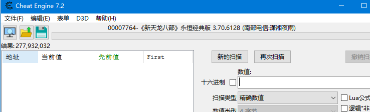

搜出来的值比较多，我们可以多搜几次未变动的数值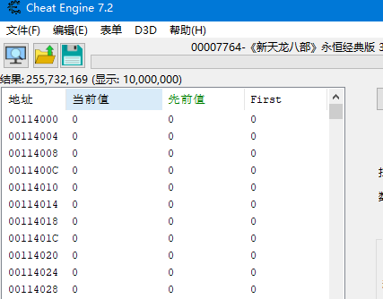

还是很多，可以尝试打坐然后站起来再搜未变动

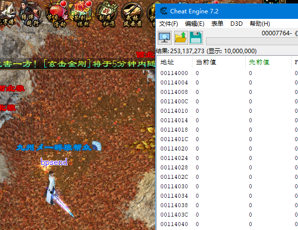

还是比较多，尝试一下打坐搜变动的

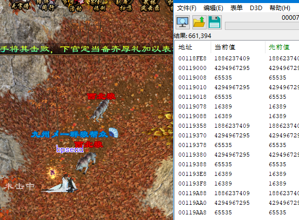

继续打坐搜未变动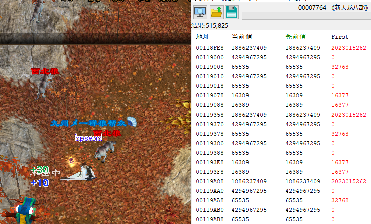

少了一点点，还是不够，站起来继续搜变动

走路，继续搜变动，走路过程中一直搜未变动

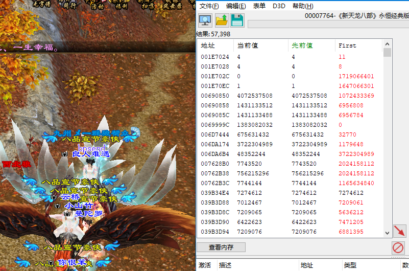

到达目的地停下来了，搜一次变动，然后搜未变动

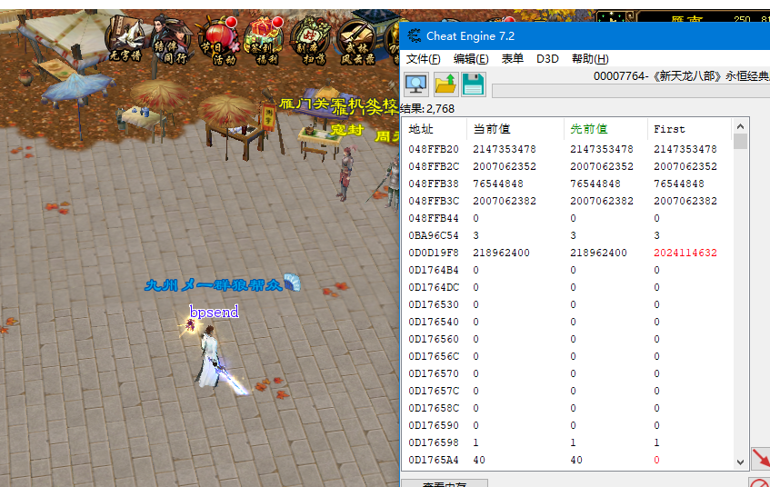

现在值还是比较多，继续走路搜变动的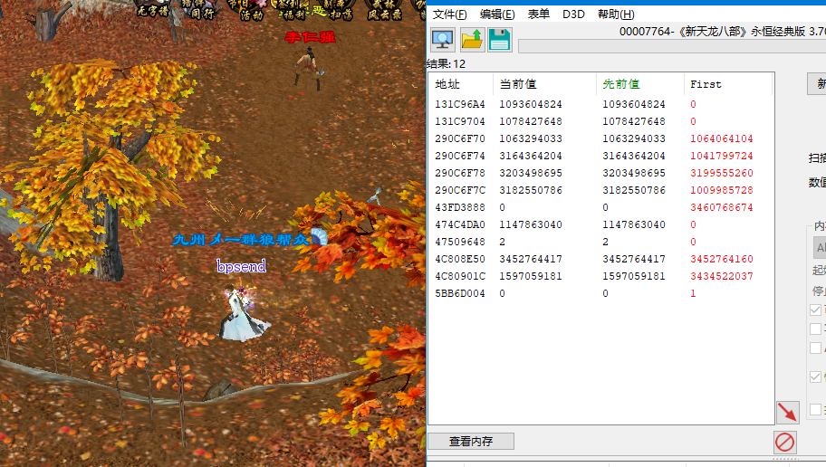

现在比较少了，等停下来再搜一次变动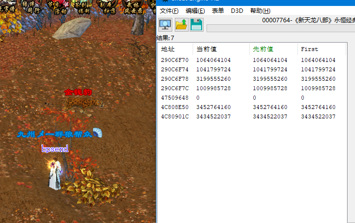

现在只剩下几个值了，从理论上来看 47509648这个地址的值比较像，因为状态值一般不会太大

站着不动的时候

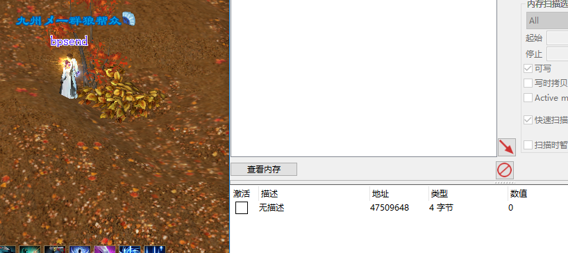

打坐的时候

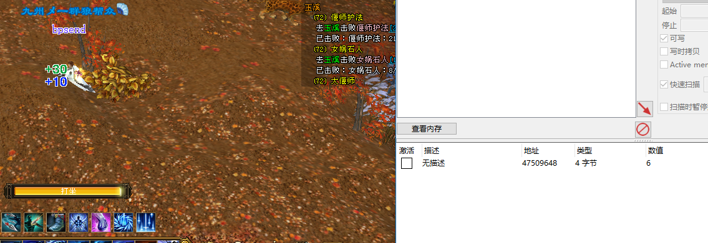

释放技能的时候

打怪的时候

走路的时候

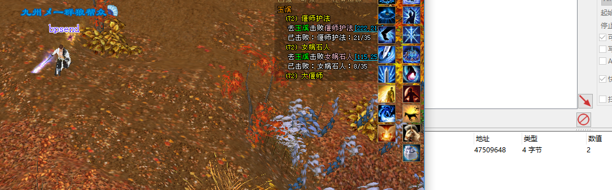

应该就是这个值了，对这个值下写入断点，然后走到一下

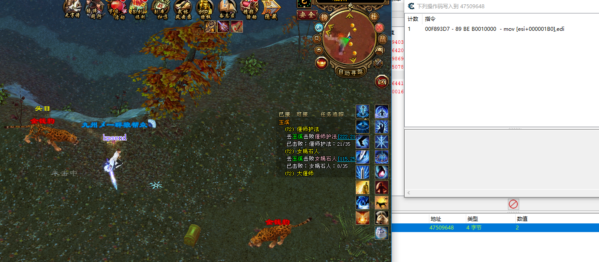

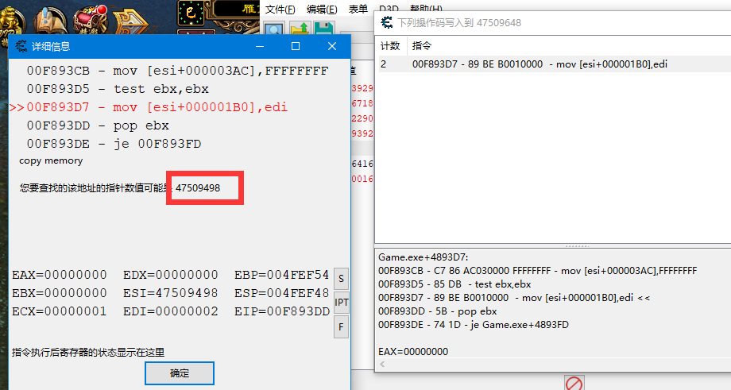

继续找47509498

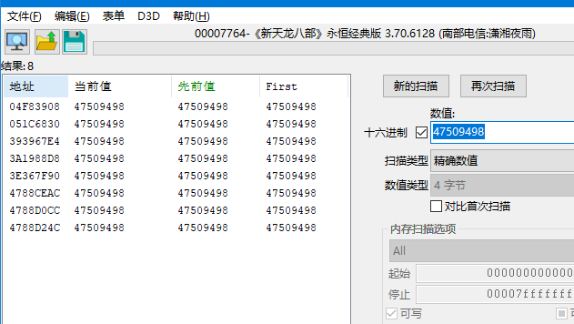

有好几条，都拉下来看一下，先对第一条下访问断点

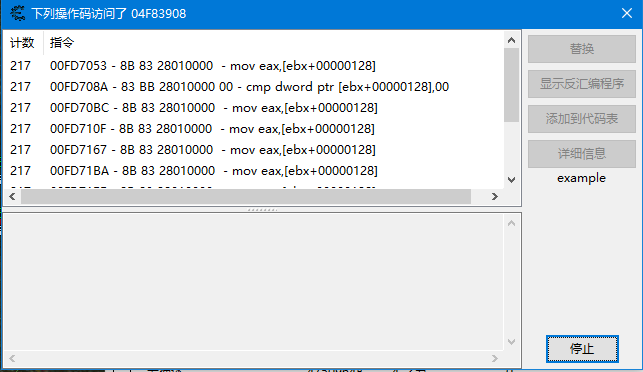

随便找一条看一下

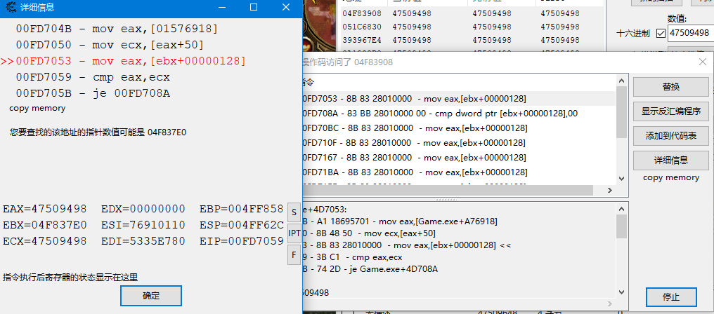

继续找04F837E0

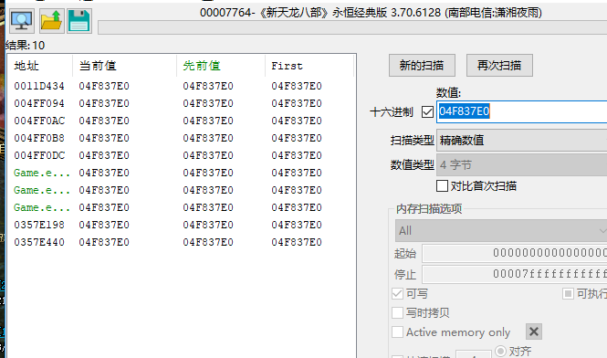

有基址了 去调试器验证一下dump [[01576f1c]+128]+1b0

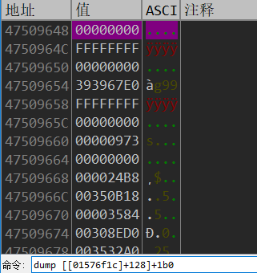

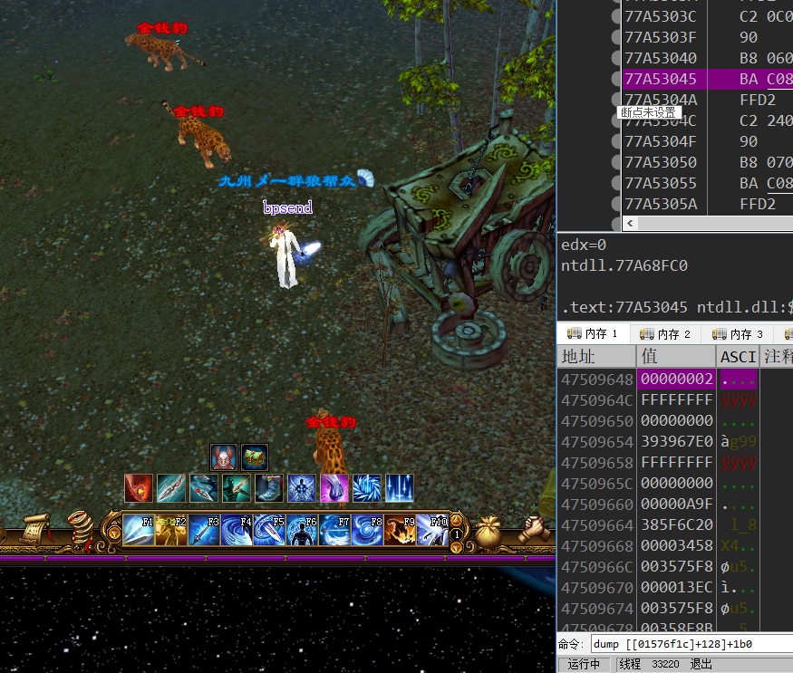