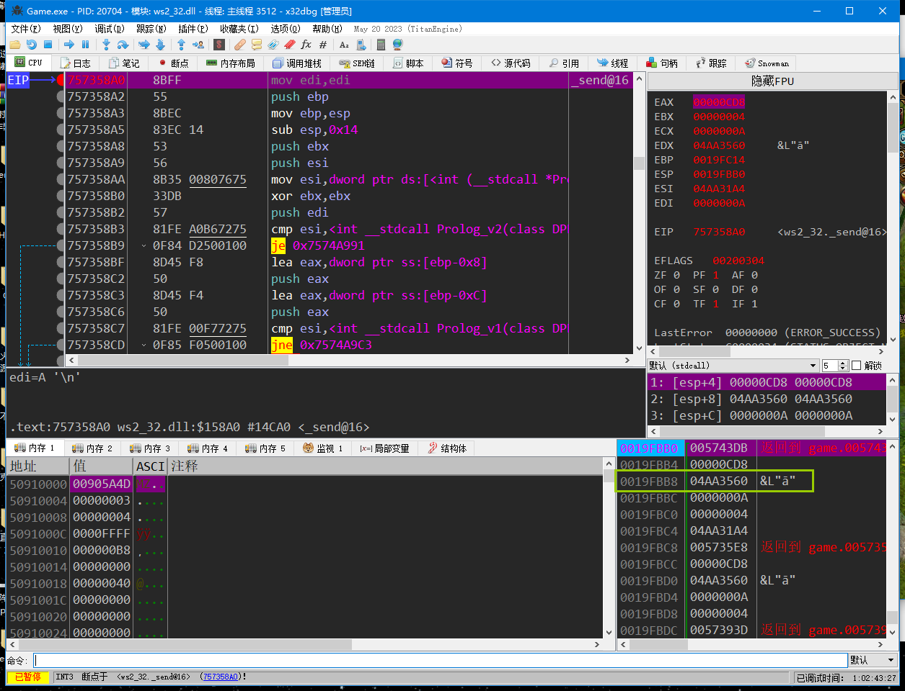
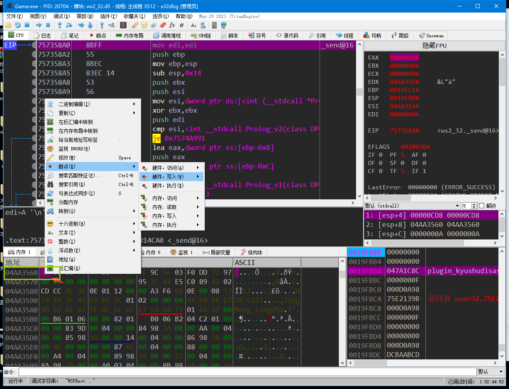
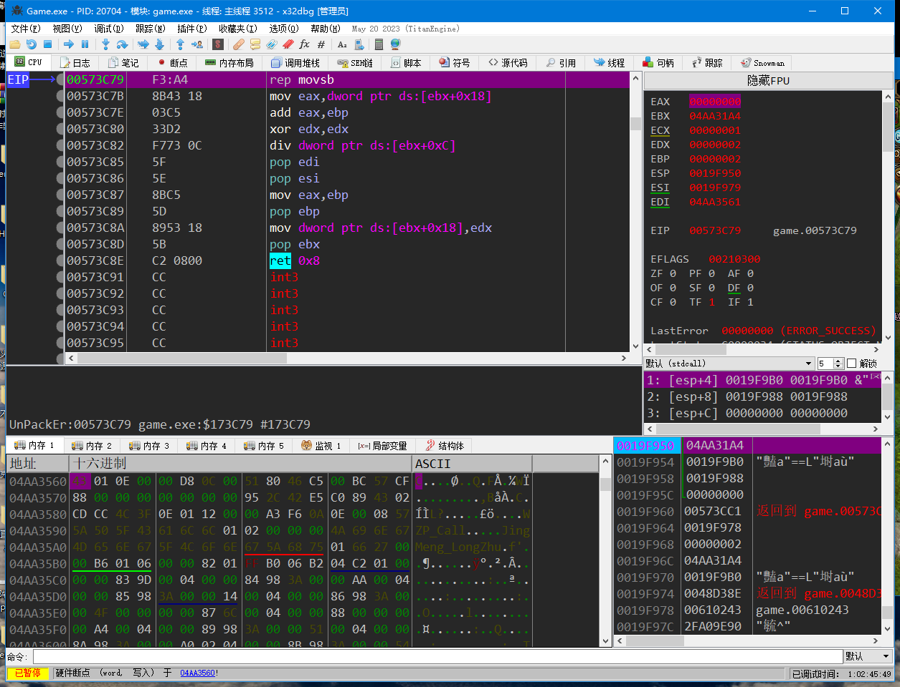
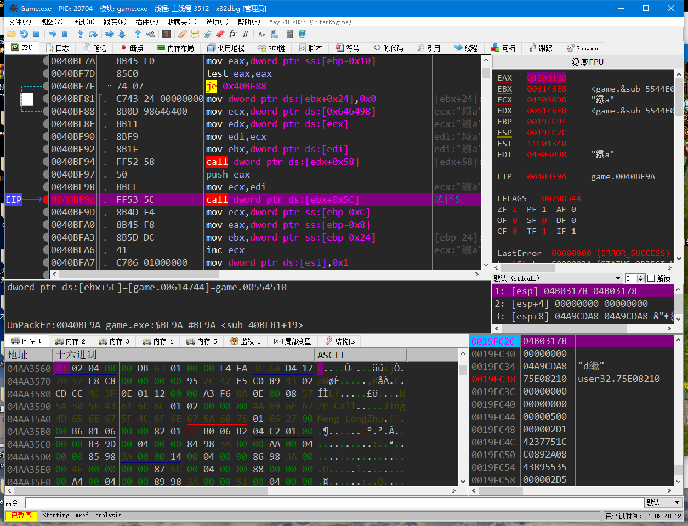
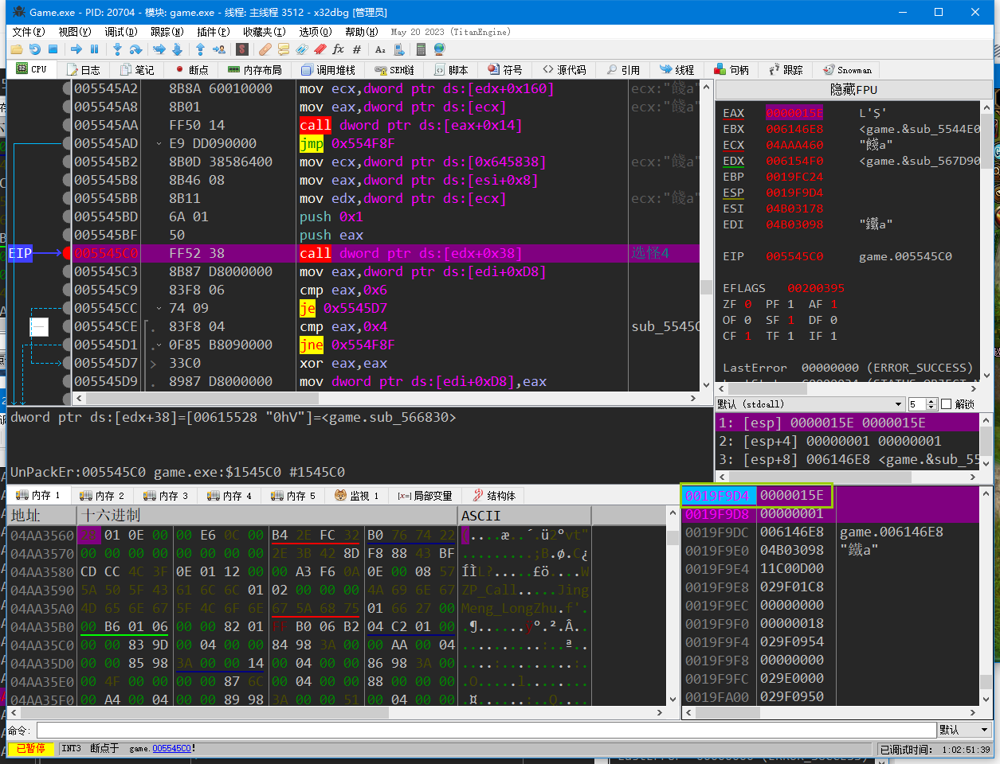
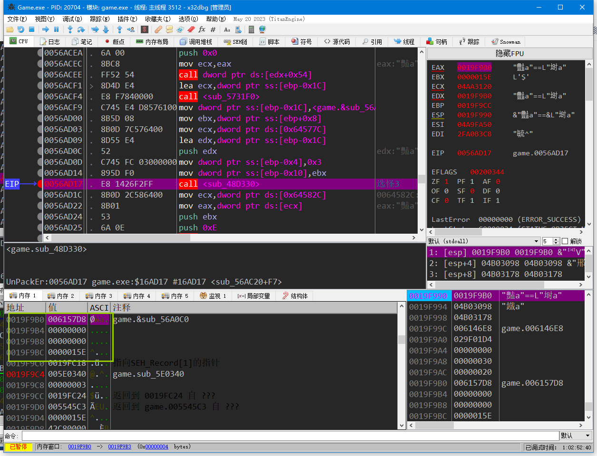
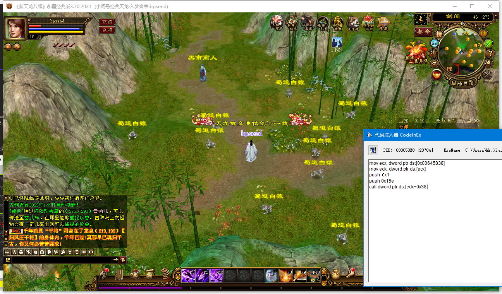
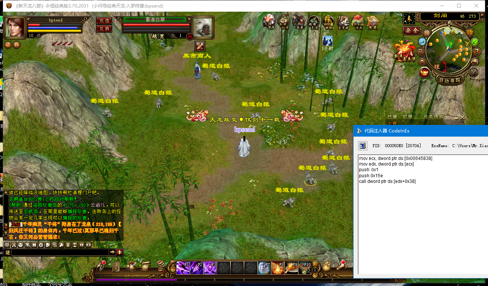
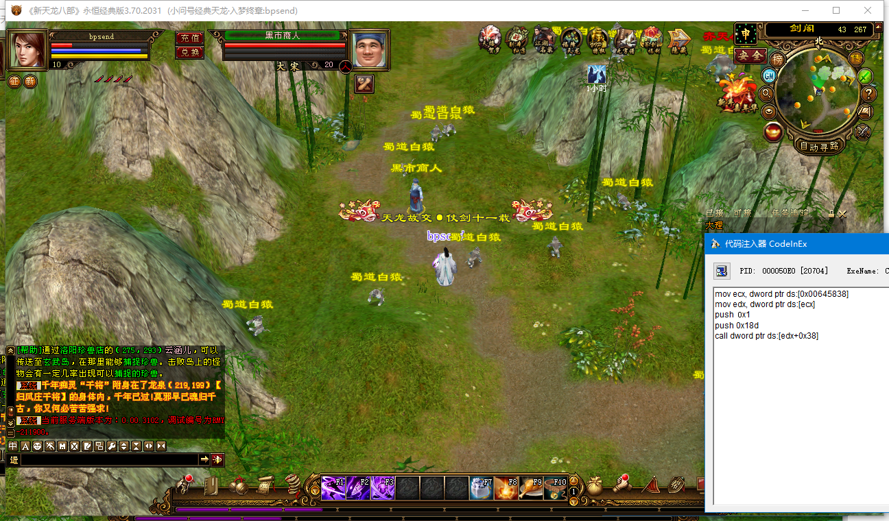

思路：通过send断点然后对send的data参数下写入断点找到游戏里面的选怪CALL来找或者通过不断选不同的对象来找到对象指针，

这里演示通过发包函数找选怪call

因为天龙这个游戏是线程发包的，所以下了send断点后要对send的data参数下写入断点

首先附加游戏，附加游戏后下send断点，命令是bp ws2_32.send



下了send断点以后，选怪就断下来了，但是经过观察发现是线程发包的，所以我们要在data参数下硬件断点



下好写入断点后，我们再选一个怪



选怪的时候游戏成功断下来了，断下来后我们先取消硬件断点，然后返回到上一层，每次返回都做好标记并下好断点，然后尝试做一些别的动作，过滤到其他功能也会调用的CALL



比如这个函数，我走路的时候也断了 删除掉，确定所有别的功能都调用的函数删掉以后，再选怪





总共断了两个地方，代码分别如上，从上面两处代码可以看出来，第一个call应该是2个参数，而且其中一个参数是固定的01 还有个参数就是我们遍历出来的怪物ID，而第二个call传了一个堆栈地址，这个堆栈地址里面也存了我们遍历出来的ID，就调用而言，肯定是第一个比较方便，所以我们先测试一下第一个是否可用

注入前：



注入后：





能够根据不同的ID选择不同的对象，说明这个call可用

调用代码如下：

```assembly
mov ecx, dword ptr ds:[0x00645838]
mov edx, dword ptr ds:[ecx]
push 0x1
push 0x18d
call dword ptr ds:[edx+0x38]
```

