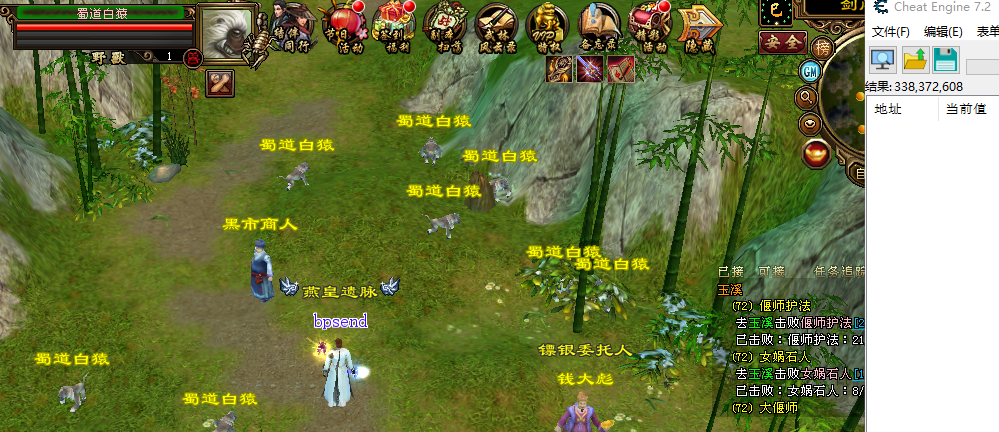
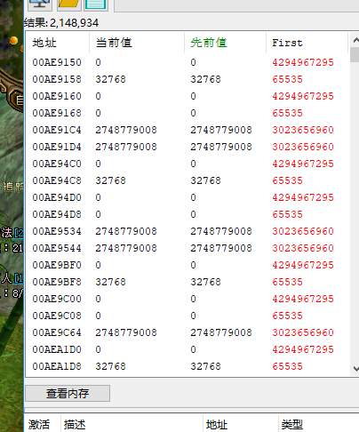
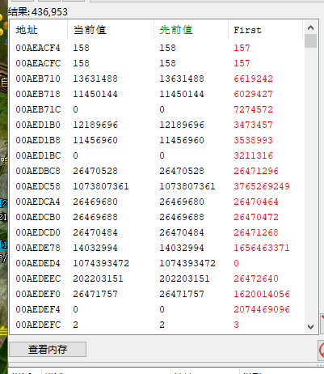
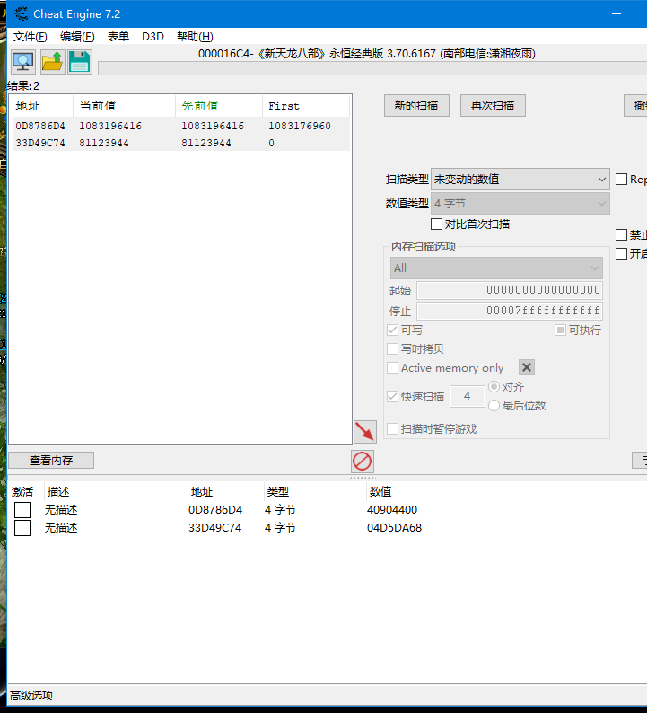
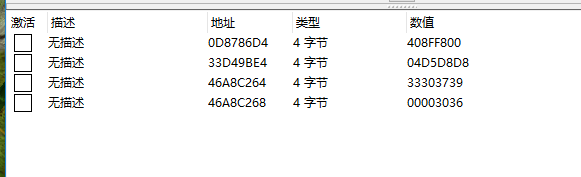
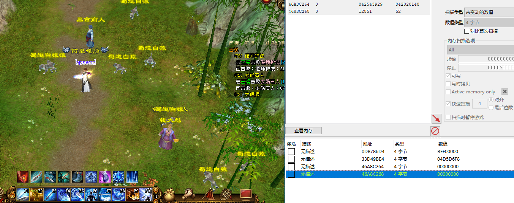
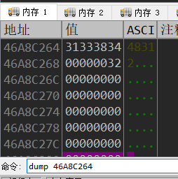
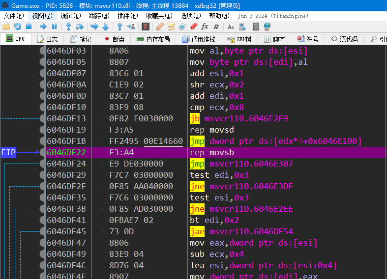
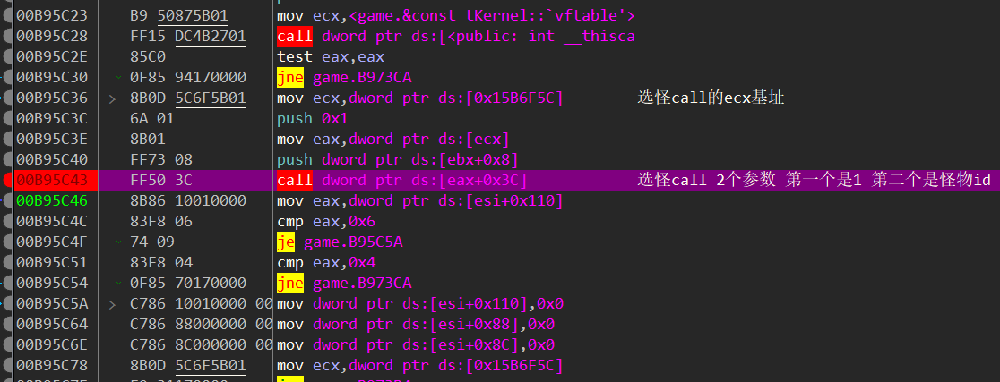

思路：我们打怪的时候按一下普通攻击或者某个攻击技能能攻击我们选中的怪物，如果没有选中怪物则会提示，这就说明其实游戏某个地方是存储了我们选中怪物的ID	或者是对象，既然它会存储，那么我们先选中一个怪物，搜未知的初始值，然后再换一个搜变动的，不断的搜索应该就能找到当前选中的怪物对象或者ID，然后对这个地址下写入断点，应该就能找到选怪call

搜出很多，没关系，我们换一个然后搜变动

还是很多，可以搜几次未变动

继续选其他的，然后搜变动

经过多次扫描后只有4个了

我们取消选怪看一下有什么变化

第一个变成了BFF00000 第三个变成了0 而且第三个之前看起来就像一个地址，所以我们先分析第三个

下面这个32看起来有点像是ID

对这个地址下写入断点，然后选其他的怪物

断在系统模块，我们直接放回上一层直到放回到游戏的模块，然后每一层下好断点，一个个分析（略）

因为之前我们用bp send的方法分析过，这里我跳了几层后就到了选怪call的地方了，其他游戏也是一样的分析过程

