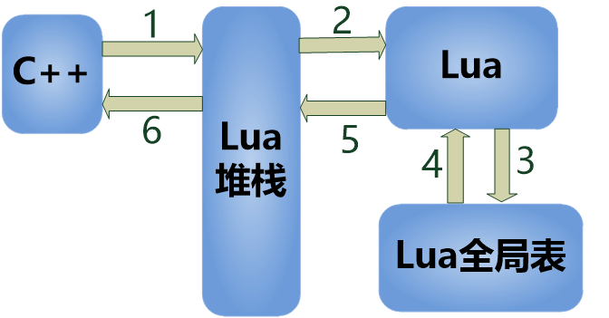
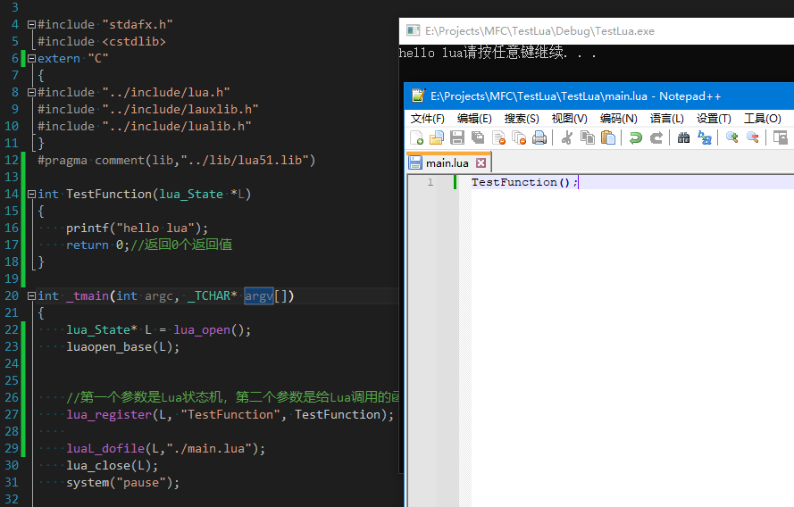
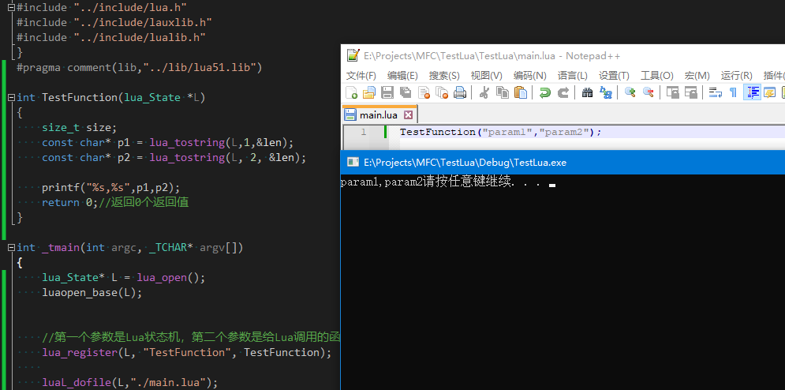

Lua与C++程序的交互

函数调用 参数传递 返回值的获取

C++和lua之间通过堆栈来交互

首先C++往堆栈写一个东西，然后Lua获取到并写到全局表 如下图



Lua栈的访问下标

​           栈顶

| 5               -1 |
| ------------------ |
| 4               -2 |
| 3               -3 |
| 2               -4 |
| 1               -5 |

​      栈底

-1访问的永远是栈顶，1访问的永远是栈底

**函数调用（Lua调用C++函数）**

首先要定义一个函数用来给Lua调用，函数的格式是int name(lua_State *L)，然后使用lua_register来注册这个函数给Lua调用

示例代码：

```
int TestFunction(lua_State *L)
{
    printf("hello lua");
    return 0;//返回0个返回值
}

//在lua_State* L = luaL_newstate();之后调用下面的代码
lua_register(L, "TestFunction", TestFunction);
```

然后我们在main.lua中直接就可以使用

TestFunction();

执行结果：



**参数传递**

C++提供给lua调用的函数如果要获取参数也是通过堆栈来传递，当我们传递参数的时候lua会把参数压入栈，第一个参数在栈底，第二个参数在栈底的上一个，最后一个参数是栈顶

**字符串传递**

在C++代码中使用lua_tostring(L,1,&len);来获取传递进来的参数，可以这么理解，第二个参数如果是1就是获取第一个参数，是2就获取第二个参数，以此类推

示例代码

const char* p1 = lua_tostring(L,1,&len);

const char* p2 = lua_tostring(L, 2, &len);

测试结果：



**整数传递**

在C++代码中使用lua_tonumber(L,1,&len);来获取传递进来的参数，位置与lua_tostring是一样的，如果只有一个参数的话，传递-1就行了

测试结果：

普通参数传递都是这么玩的，比如bool 浮点数等，只要对应的lua_to...转换的类型正确即可，需要注意的是，我们C++提供的接口自己要确定好有几个 参数，哪个参数是什么类型