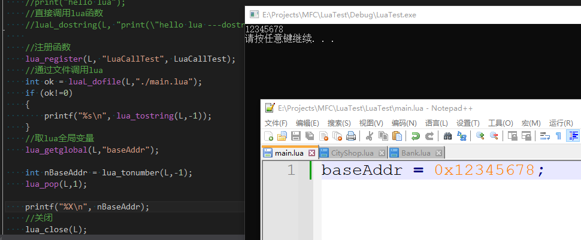
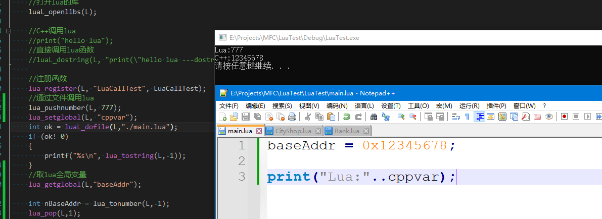
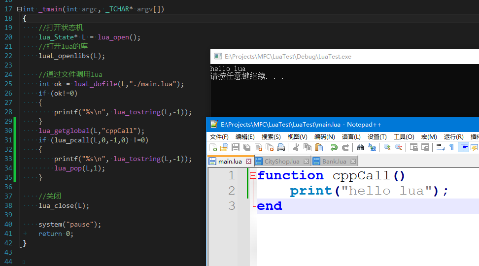

**C++访问Lua全局变量**

​    C++读取Lua全局变量

C++访问lua全局变量一般来讲是做全局配置使用的比较多，访问Lua的全局变量使用Lua_getglobal函数来实现，这个函数第二个参数是变量名，这个函数会把全局变量的值压入到栈顶，然后我们通过lua_to...(,-1)即可取出，注意，因为Lua_getglobal函数会压栈，所以我们需要调用lua_pop来平栈

我们可以使用lua_gettop来检测栈是否平衡

这里需要注意的是，一定要在lua_dofile以后调用，因为不加载这个lua文件的话，我们也没有这个全局变量，在实际开发辅助项目中，我们可以把游戏的基址写在lua中而不是写在.h文件用宏来定义

​    C++设置Lua全局变量

C++给lua设置全局变量直接使用lua_push...函数压栈，压栈后再调用lua_setglobal函数将栈顶的位置的值设置给全局变量并出栈，因为这个函数会出栈，所以不需要我们自己来平栈，这个函数的的第二个参数是全局变量名

**C++调用Lua函数**

C++调用Lua最好是在同一个线程中，如果在不同线程中的话可能对造成多线程写同一个栈的错误，解决办法是要么在同一个线程中调用，要么改写Lua源码加锁的部分，lua默认是没有加锁的

C++调用Lua函数可以使用lua_getglobal(L,函数名) 然后调用lua_pcall(lua,0,0,0)第一个参数是Lua状态机指针，第二个参数是参数数量，第三个参数是返回值，第三个参数是出现错误时执行的函数，填的是栈中的地址，我们先都传0，这个函数返回非0时表示执行失败，如果我们没有传递错误函数的话，错误信息会压入栈顶，也可以在load lua文件后再使用lua_dostring

