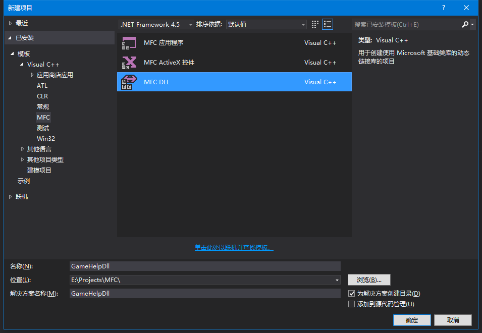
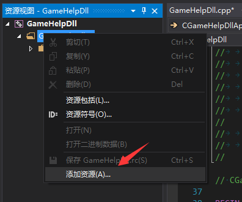
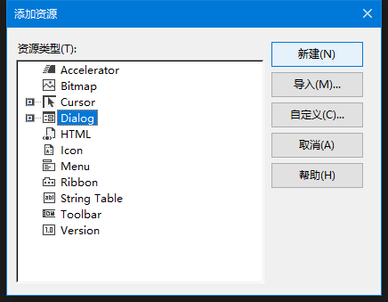
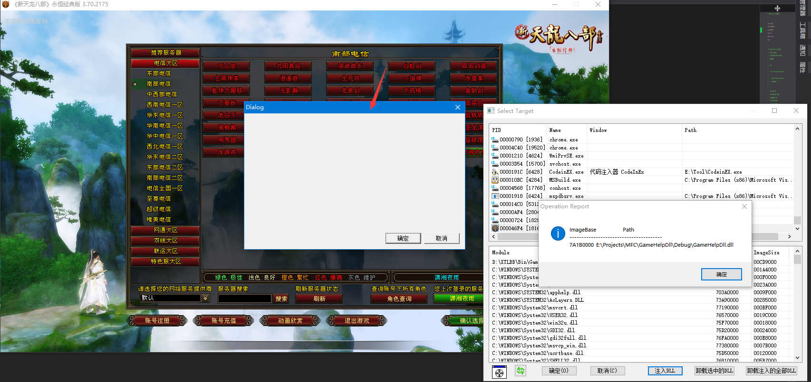
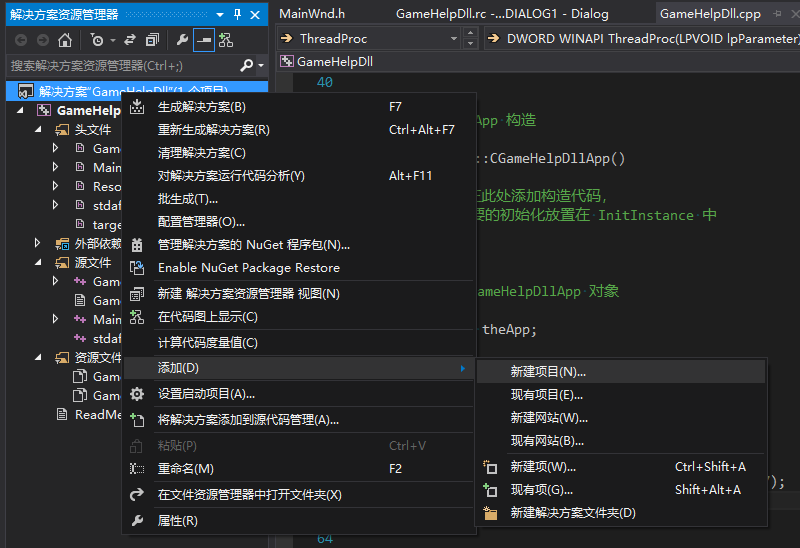
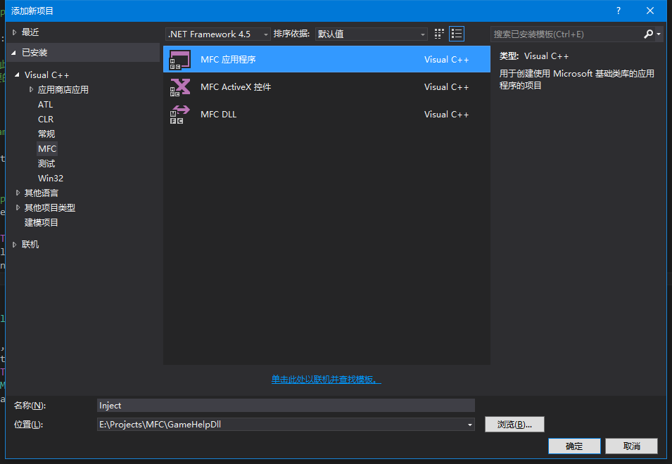
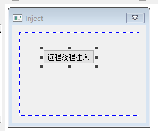
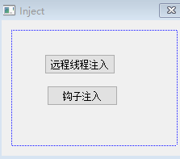
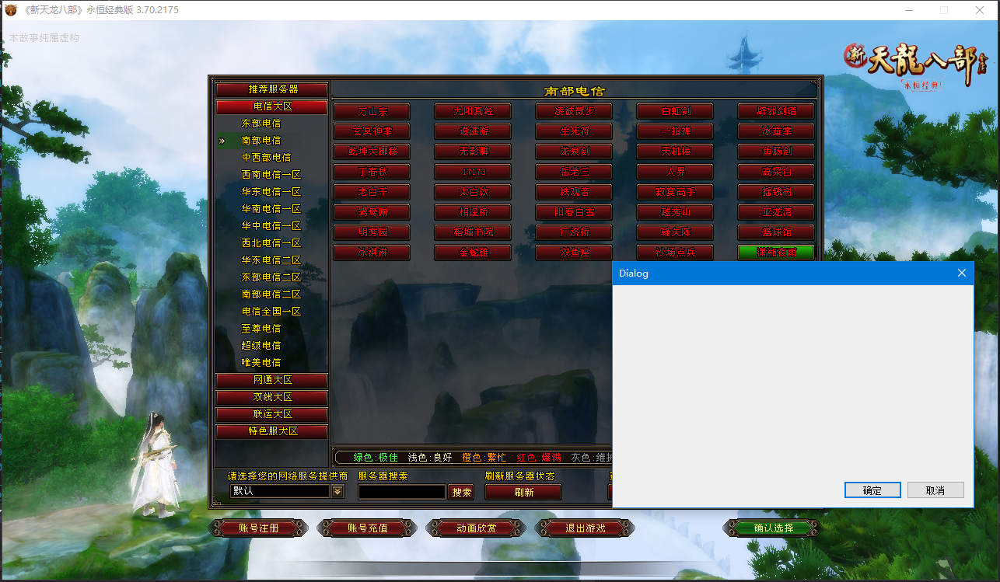

为了实现我们的辅助，我们还需要注入一个动态库到游戏中，我们打开vs新建一个MFC DLL的工程



工程新建完毕后，我们在我们的DLL中新建一个对话框





对话框新建好了以后，我们双击对话框，给对话框添加一个类

### 远程线程注入

然后在BOOL CGameHelpDllApp::InitInstance()函数中添加以下代码：

```c++
AFX_MANAGE_STATE(AfxGetStaticModuleState());
pDlg = new CMainWnd;
::CreateThread(NULL, NULL, ThreadProc, NULL, 0, 0);
```

线程处理函数如下：

```c++
DWORD WINAPI ThreadProc(LPVOID lpParameter)
{
    AFX_MANAGE_STATE(AfxGetStaticModuleState());
    pDlg->DoModal();
    FreeLibraryAndExitThread(theApp.m_hInstance, 777);
    return 0;
}
```

现在我们的DLL注入游戏就能显示一个窗口了，我们使用工具注入测试一下



好了，现在工具把我们的DLL注入到游戏中可以显示一个对话框了，我们再升级一下，自己写个注入工具，以后就不用打开代码注入器了，我们在我们的工程中新建一个项目



项目类型就选MFC应用程序





在对话框中拉一个按钮出来，双击按钮，给按钮加入注入代码

```c++
char szDllPath[] ="E:\\Projects\\MFC\\GameHelpDll\\Debug\\GameHelpDll.dll";
    int nPid = GetProcessIdFromName("game.exe");
    HANDLE hGameProcess = OpenProcess(PROCESS_ALL_ACCESS, false, nPid);
    FARPROC func = GetProcAddress(GetModuleHandleA("kernel32"), "LoadLibraryA");
    LPVOID szRemoteDll = VirtualAllocEx(hGameProcess, NULL, strlen(szDllPath) + 1,
        MEM_COMMIT, PAGE_EXECUTE_READWRITE);

    WriteProcessMemory(hGameProcess, szRemoteDll, szDllPath,
        strlen(szDllPath) + 1, NULL);
    HANDLE thread = CreateRemoteThread(
        hGameProcess, NULL, 0, LPTHREAD_START_ROUTINE(func), szRemoteDll, 0, NULL);
    WaitForSingleObject(thread, INFINITE);

    CloseHandle(thread);
    VirtualFreeEx(hGameProcess, szRemoteDll, strlen(szDllPath) + 1, MEM_DECOMMIT);
```

```
long GetProcessIdFromName(const char *name)
{
    HANDLE hsnapshot = CreateToolhelp32Snapshot(TH32CS_SNAPPROCESS, 0);
    if (hsnapshot == INVALID_HANDLE_VALUE)
    {
        return -1;
    }

    PROCESSENTRY32 processer;
    processer.dwSize = sizeof(PROCESSENTRY32);

    int flag = Process32First(hsnapshot, &processer);
    while (flag != 0)
    {
        _bstr_t processName(processer.szExeFile);  //WCHAR字符串转换成CHAR字符串
        if (_stricmp(processName, name) == 0)
        {
            return processer.th32ProcessID;        //返回进程ID
        }
        flag = Process32Next(hsnapshot, &processer);
    }

    CloseHandle(hsnapshot);
    return -2;
}
```


### 消息钩子注入

我们在我们的DLL中提供一个接口，给注入程序调用，接口代码如下：

```c++
void GameHook()
{
    ::SetWindowsHookEx(WH_GETMESSAGE, GetMsgProc, ::GetModuleHandle(_T("MemPlugin.dll")), 0);
}
```

GetMsgProc代码如下：

```c++
LRESULT CALLBACK GetMsgProc(int code, WPARAM wParam, LPARAM lParam)
{
    AFX_MANAGE_STATE(AfxGetStaticModuleState());
    if (code == HC_ACTION)
    {
        static bool bIsInject = false;
        if (!bIsInject)
        {
            PMSG pMsg = (PMSG)lParam;
            char szClassName[256] = { 0 };
            GetClassNameA(pMsg->hwnd, szClassName, 256);
            if (strcmp(szClassName, "TianLongBaBu WndClass") == 0)
            {
                bIsInject = true;
                HANDLE hThread = CreateThread(NULL, 0, ThreadProc, pMsg->hwnd, 0, 0);
                CloseHandle(hThread);
            }
        }
    }
    return CallNextHookEx(0, code, wParam, lParam);
}
```

在DEF文件增加一个导出接口

然后再给我们的对话框加个按钮



在钩子按钮消息中加入对GameHook();的调用，注意要应用我们dll的lib

