通过对C/C++与lua的交互了解到，与lua交互主要是通过lua_dostring和lua_dofile两个函数来传递需要调用的函数，既然如此，我们要知道游戏使用了什么lua函数或者调用了什么文件，那么hook这两个函数即可，现在在调试器中试一下，验证我们的猜想

在游戏刚启动的时候用调试器附加游戏并暂停（这么做的目的是为了防止有些游戏在启动的时候就把lua文件解密都加载到内存中，我们错过获取时机），附加后里面对lua_dostring和lua_dofile下断点，对这个函数下断点可以用bp命令来下段，也可以在调试器中打开符号窗口

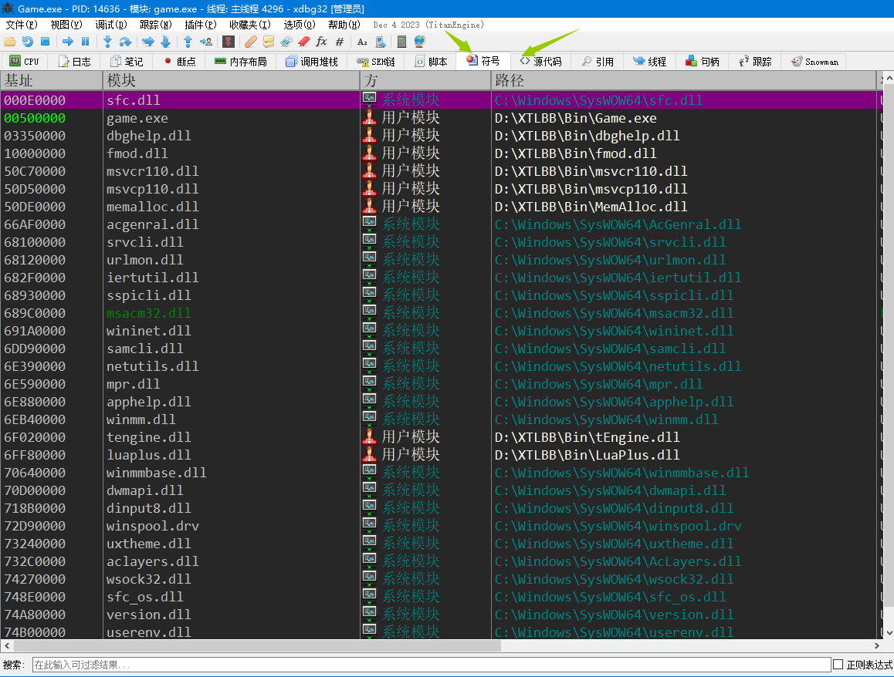

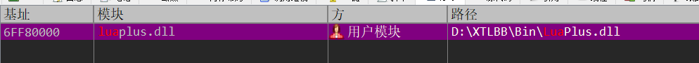

找到这个模块后再找到我们需要的这两个函数


双击右边的函数名称就可以跳转到函数头部了

下好断点后，按F9运行游戏

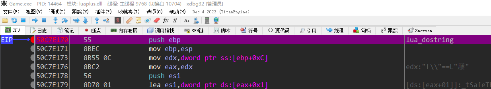

游戏运行起来后lua_dostring立马就断了，我们看看堆栈中的参数

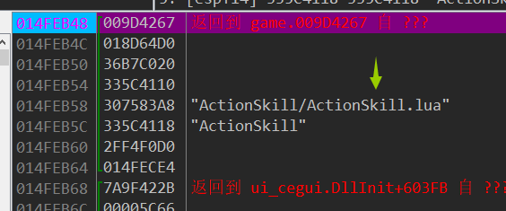

可以看到，参数中有lua文件。我们直接返回到调用的地方，在调用的地方下断点观察一下

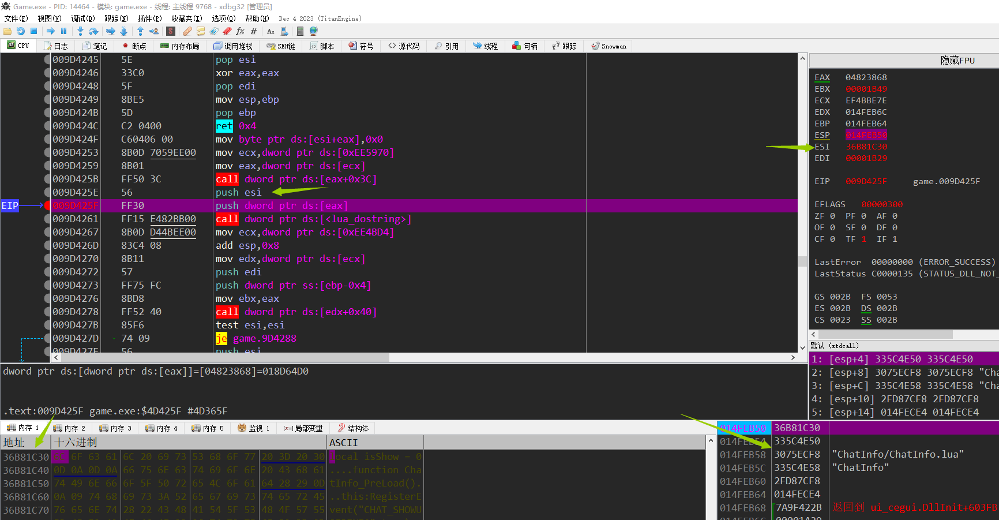

我们可以看到，堆栈中有lua文件名，然后esi这个参数是lua的内容，eax肯定就是lua状态机的指针的，eax的如何来的先不管，我们这次主要任务就是把lua文件都给读出来

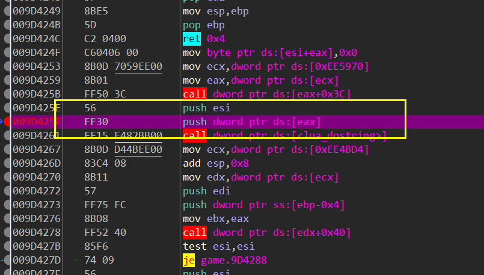

我们可以在hook push dword ptr ds:[eax] 这句代码，然后获取esp+0(lua文本)和esp+8(lua文件名)，理论有了，现在来实践实践。

在VS中建立一个DLL的工程，并在DLL中建立一个对话框（为了方便之后测试游戏lua函数）

在对话框初始化的时候加入hook点 代码如下：

CVehHook::GetInstance()->AddVeh("GetFile", "Game.exe", 0x4D425f, 0, 2, 0, LuaHookGetFileFun);

CVehHook::GetInstance()->InitVeh();

这段是之前写好的veh hook库，第一个参数是hook的标识（自己随便取个名字即可），第二个参数是hook哪个模块，第三个参数是hook点距离要hook的模块基址的偏移（即当前要hook点的地址减去game.exe的首地址），第三个参数给0即可，第4个参数是hook的字节数，第5个参数是hook是否只执行一次，最后一个参数是hook的回调（也就是hook后要执行的我们的代码）

回调函数的定义如下：

void LuaHookGetFileFun(struct _EXCEPTION_POINTERS * ExceptionInfo)

{}

现在我们hook后没有执行任何代码，我们挂上hook后去调试器中看一下 是否hook成功

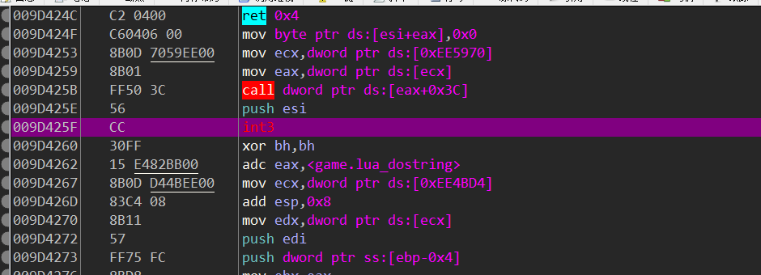

可以看到，这里已经hook了，也就是说会执行我们的函数，我们只要在我们的回调函数中获取esp+0 esp+8并写入文件就OK了

回调函数代码如下：

```c++
void LuaHookGetFileFun(struct _EXCEPTION_POINTERS * ExceptionInfo)
{
    char* szLuaText = (char*)*(DWORD*)(ExceptionInfo->ContextRecord->Esp + 0);//读取lua脚本
    string szLuaFile = (char*)*(DWORD*)(ExceptionInfo->ContextRecord->Esp + 8);//获取lua文件名
    int nPos = szLuaFile.rfind("/");//因为获取到的文件名是xxx/xxx.lua所以要去掉/前面的部分
    if (nPos == -1)
    {
        nPos = 0;
    }
    szLuaFile = szLuaFile.substr(nPos);//取出/后面的部分

    /*组织文件名 并写入文件*/
    string strFullPath = "D:\\TLBBLUA" + szLuaFile;
    HANDLE hFile = CreateFileA(strFullPath.c_str(), GENERIC_WRITE|GENERIC_READ, FILE_SHARE_READ, NULL, CREATE_ALWAYS, FILE_ATTRIBUTE_NORMAL, NULL);
    if (hFile == INVALID_HANDLE_VALUE)
    {
        DWORD dwEerr = GetLastError();
        CString strErr;
        strErr.Format(_T("%s err:%d"), strFullPath.c_str(),dwEerr);
        MessageBox(0, strErr, 0, 0);
        return;
    }
    DWORD dwBytesWritten = 0;
    SetFilePointer(hFile, 0, NULL, FILE_BEGIN);
    WriteFile(hFile, szLuaText, strlen(szLuaText) + 1, &dwBytesWritten, NULL);
    CloseHandle(hFile);
```

游戏一启动我们就注入，最后获得到很多游戏的LUA文件

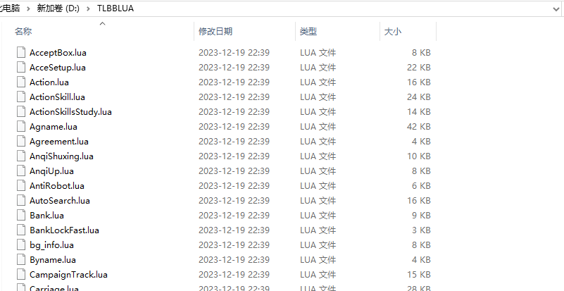

需要注意的是，上面的代码有坑，需要在D盘创建一个TLBBLUA文件夹，CreateFile函数会失败！

OK 既然lua文件也有了，我们就获取一下lua的状态机，然后尝试调用其中一条命令试试，要调用游戏里面的lua功能，除了lua函数、状态机还需要获得lua_dostring的函数地址，lua_dostring函数地址好获取，只要HMODULE hLua = GetModuleHandle(_T("luaplus.dll")); g_fnLua_dostring = (FNLUA_DOSTRING)GetProcAddress(hLua, "lua_dostring");就能获取到了，状态机如何获取呢？我们跳转到刚刚执行lua_string那里看看他的状态机是如何获取的，或者可以hook对方初始化lua的函数获得状态机

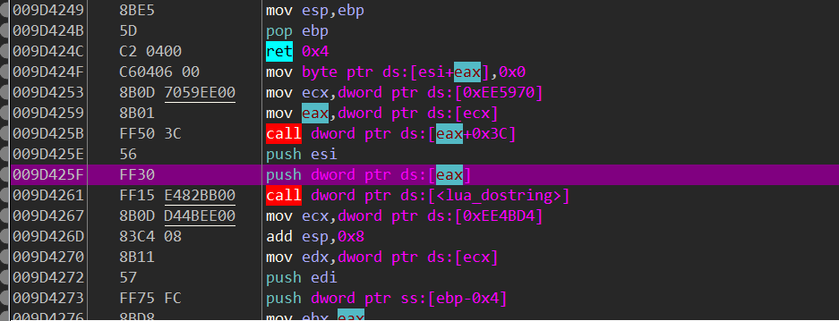

状态机应该是这个call的返回值，我们直接调用了算了，懒得看函数内部实现了

```c++
__asm
    {
        mov ecx, dword ptr ds : [0xEE5970];
        mov eax, dword ptr ds : [ecx];
        call dword ptr ds : [eax + 0x3C];
        mov g_dwLua, eax;
    }
    g_dwLua = *(DWORD*)g_dwLua;
```

现在我们只要执行 就能调用了

g_fnLua_dostring(g_dwLua, LUA函数);

OK 我们去刚刚获取到的文件中找几个函数试试

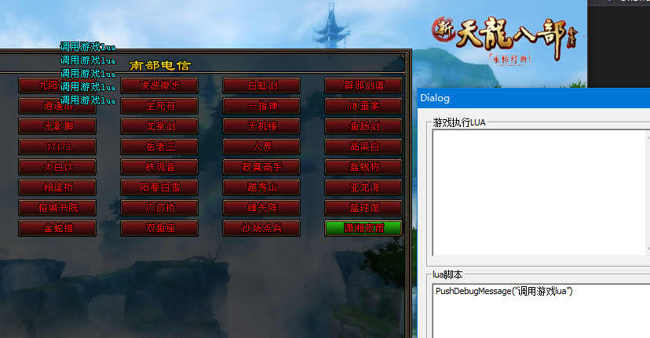

这个函数可以调用

在登陆游戏看看能不能走路


这个看起来像是走路的，调用试试

调用之前的坐标

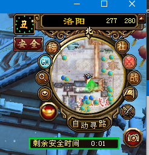

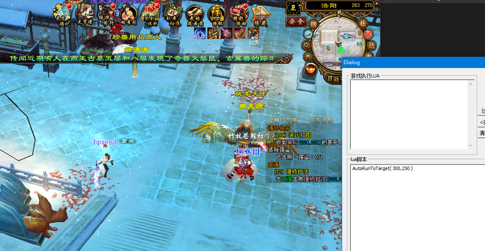

确实已经走起来了

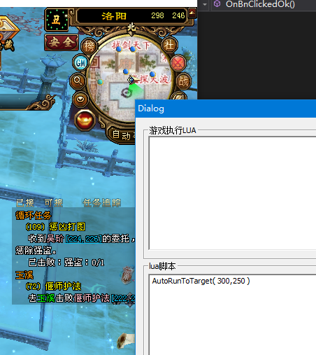

说明获取到的游戏LUA是正确的，要不然我们调用它里面的函数也不会成功