## 编译环境

​	编译CE驱动需要安装wdk 和 sdk 驱动编译好以后需要签名（网上随便找个过期签名 改一下系统时间来签吧~）

安装包地址(需要先安装vs2019记得把V142装上~总之就是C++windows桌面开发环境)：

[win10Sdk](./win10 SDK.exe)

[win10wdk](./win10wdk.exe)

[数字签名工具时间补丁](./数字签名工具时间补丁.zip)

装好VS2019以后，安装sdk和wdk

安装过程省略......

## 编译CE驱动

### 1、修改CE驱动服务名和文件名

在编译CE驱动之前，首先要修改一下CE源码中关于驱动服务名、调用的驱动名，因为默认的服务名和驱动文件名是被游戏厂商给和谐掉的，我们打开CE源码

点击菜单上的工程--单元

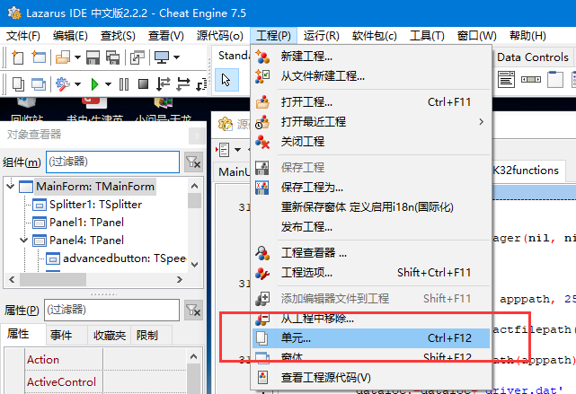

输入dbk32funciton

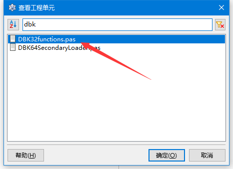

打开DBK32functions.pas这个文件

搜索dbk32.sys这个字符串

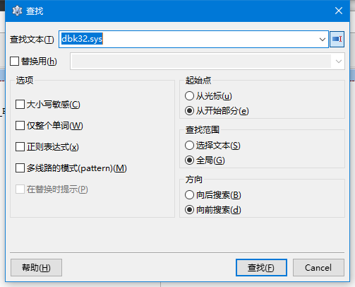

找到以下地方，把dbk32 dbk64 CEDRIVER73改成自己的名字

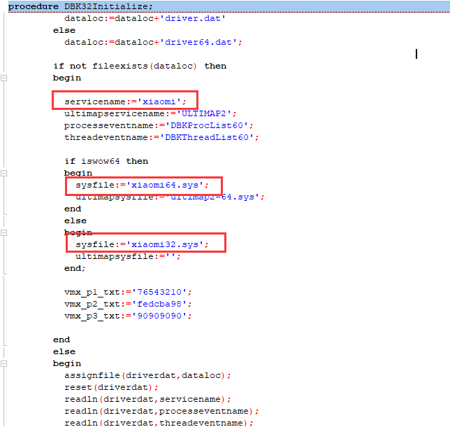

然后重新编译CE即可

### 2、编译驱动

修改完了以后 打开CE源码中DBKKernel文件夹，然后使用VS2019打开DBKKernel.sln

平台改为x64，配置改为Release without sig

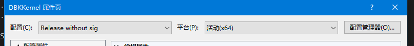

项目属性中的常规，目标文件名改成你自己的驱动文件名

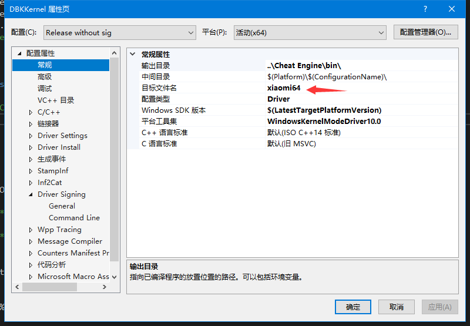

项目属性中的生成事件--生成后事件--命令行里面的内容全部删除

项目属性中的 Driver Signing中的 sign Mode改为off（因为我们需要自己改系统时间签名，如果你可以在这里直接签名当我没说）

然后再解决方案管理器中打开dbk64.inf

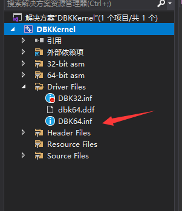

打开后替换dbk64这个字符串为你自己的驱动名

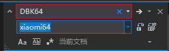

因为我给我自己驱动取名叫xiaomi64 所以我替换成xiaomi64

以上步骤做完以后，即可正常编译，如果报错的话不是你SDK有问题就是你的WDK有问题，你可以建立一个空的驱动项目编译试试

编译成功后可以看到，在ce源码的bin目录里面多了一个驱动文件

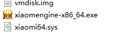

### 3.驱动签名

因为x64加载驱动要求驱动必须有数字签名，所以我们还要给驱动签名才能使用

建议在虚拟机win7环境下签

首先我们安装驱动签名工具（安装过程省略）

打开我们的驱动签名工具，选择证书管理

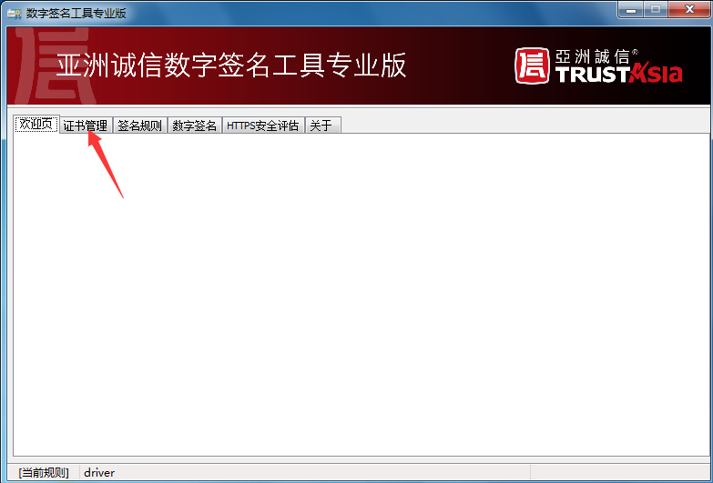

点导入

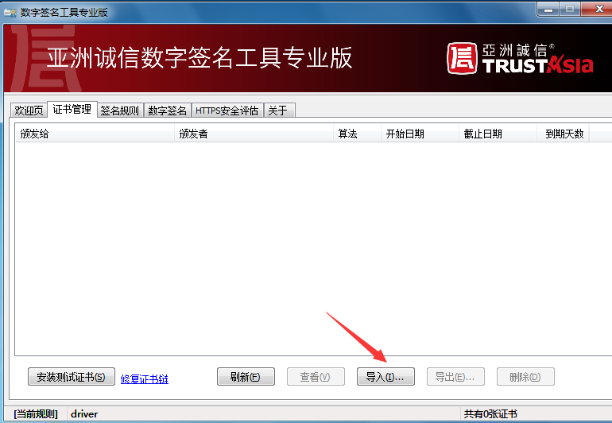

点导入

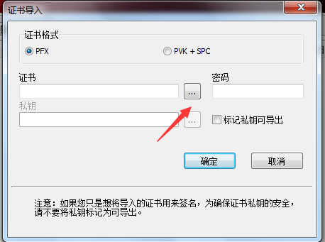

选择我们的证书文件(pfx)

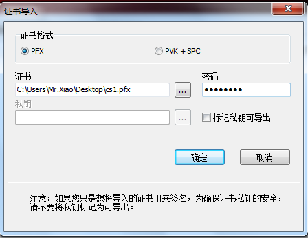

输入密码后点击确定

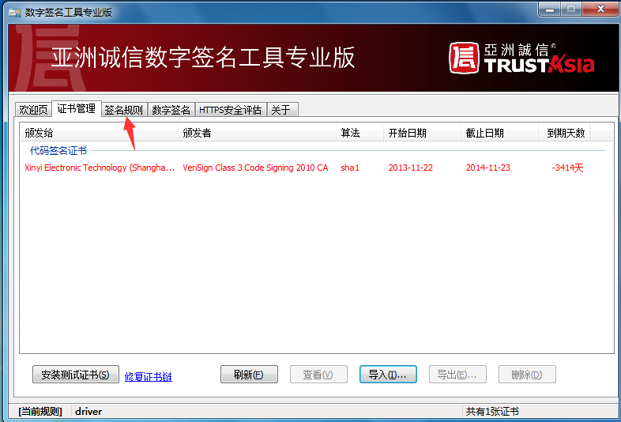

点击签名规则

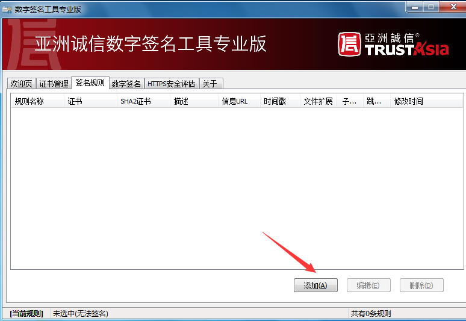

点击添加

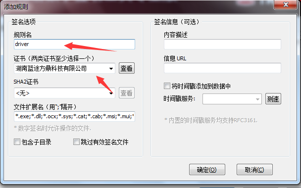

输入一个规则名，然后选择证书，点确定

然后把系统时间改为开始日期之后，截止日期之前

点击数字签名

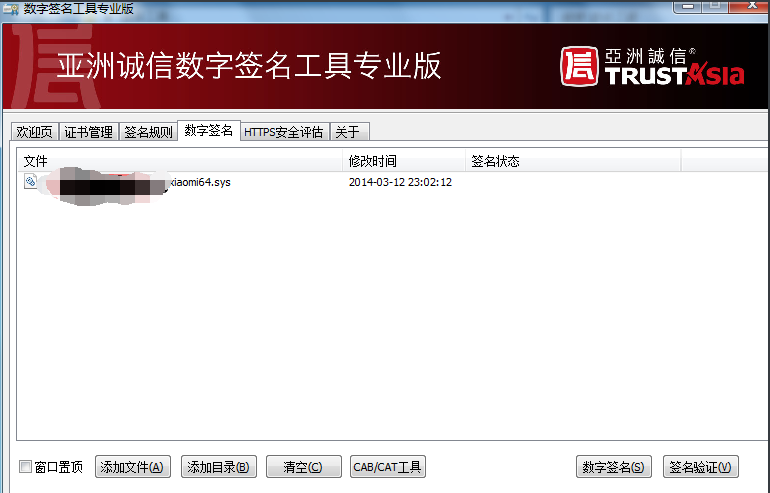

把我们的驱动拖进去，然后点数字签名

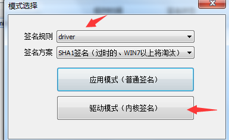

规则点刚才创建的，然后点驱动模式

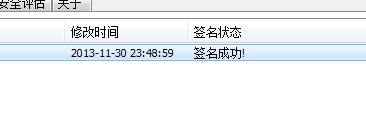

显示签名成功即可，然后把我们的驱动文件复制到ce的bin目录下

不出意外的话意外会发生，现在打开CE加载驱动会发现竟然报错了~

### 3.制作镜像文件

制作镜像文件需要一个linux操作系统，这里我在VM中安装了一个ubuntu

我们首先在unubtu系统中输入 sudo apt install -y build-essential yasm nasm openssh-server lrzsz net-tools 来安装必要的环境

装好以后在CE源码目录中把dbvm文件夹复制到ubuntu中，然后在终端进入这个文件夹

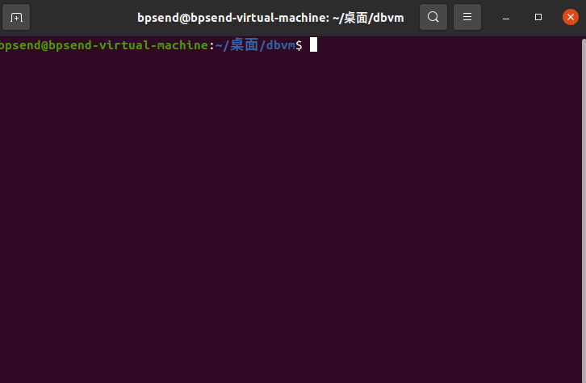

然后输入 sudo make install

不出意外的话，你等待一会就能看到 chmod 777 vmdisk.img了，然后这个文件夹里面也多出了一个vmdisk.img文件，我们把这个文件也复制到CE的bin目录中，然

后再以管理员权限运行CE，这个时候CE驱动肯定是能加载了

我们打开CE 打开CE帮助--关于，显示你的系统支持dbvm 然后点一下这行文字

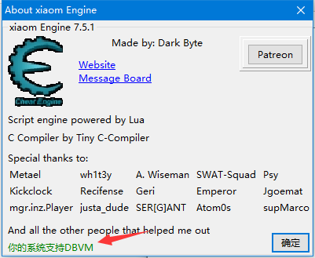

系统右上角显示了一行让人感动的字

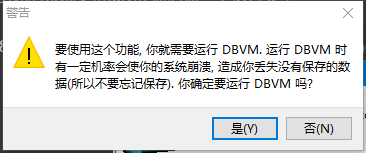

也弹出了一个对话框，我们点确定

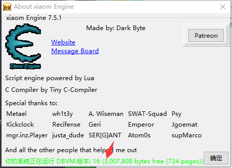

发现驱动已经加载进来了