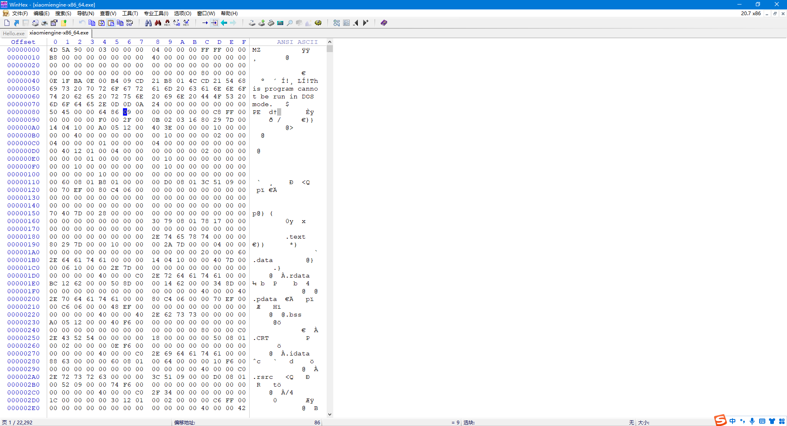
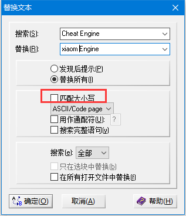
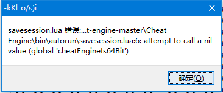
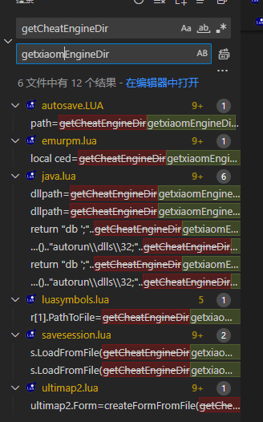
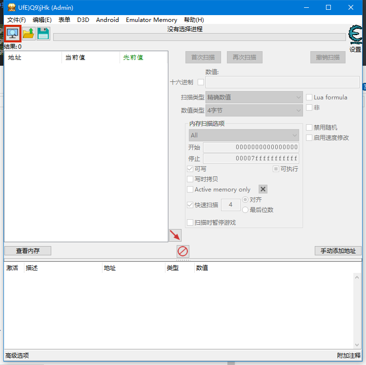

### CE特征修改

​	虽然我们现在已经编译了一个过保护的ce，但是这货里面还是有很多CE的特征，比如cheat-engine这个字符串，现在我们需要把这些字符串都给改掉，要不然碰到游戏扫描进程内存的时候我们还是会被检测到的

我们随便找一个16进制编辑器，可以是winhex也可以是HxD或者是010edit 喜欢用什么看个人喜好

打开16进制编辑器后，我们把我们编译好的拖到16进制编辑器中

然后替换

不要匹配大小写

注意，我们替换的字符要和cheat engine一样多（有空格的时候12个字符）

acscii unicode都要替换

我这里把

cheat engine 替换成xiaom engine

然后替换没有空格的

同样的，字符串长度要一致

我这里把

CheatEngine替换成了xiaomEngine

替换完了保存即可

保存后我们运行我们的CE

不出意外的话就要出意外了

我们运行的时候直接提示了错误，但是点了确定以后可以正常运行。如果你不介意的话就不用继续改了

反正我有点介意

这是因为我们替换CheatEngine字符串的时候，把CE导出给LUA调用的函数名也给改掉了，所以产生了错误，只要我们改掉对应lua文件中的函数名即可。我们随便找个IDE打开cheat-engine-master\Cheat Engine\bin\autorun文件夹

把 cheatEngineIs64Bit 替换成 xiaomEngineIs64Bit把getCheatEngineDir替换成getxiaomEngineDir(注意，所有文件中的都要替换)

替换完了以后保存即可

现在打开就没有报错了
