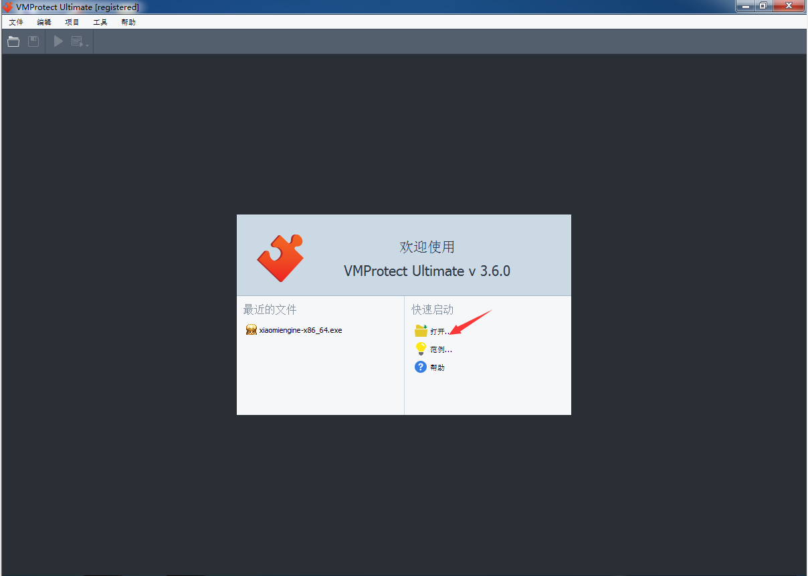
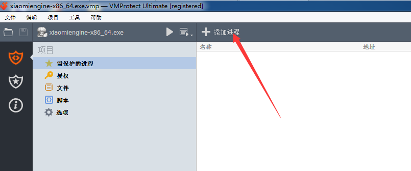
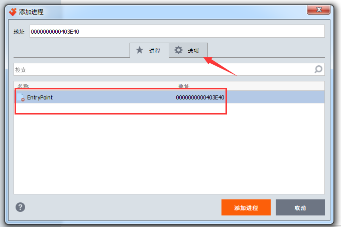
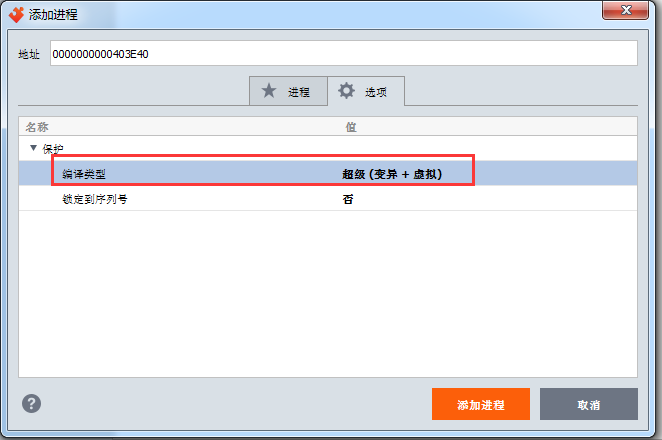
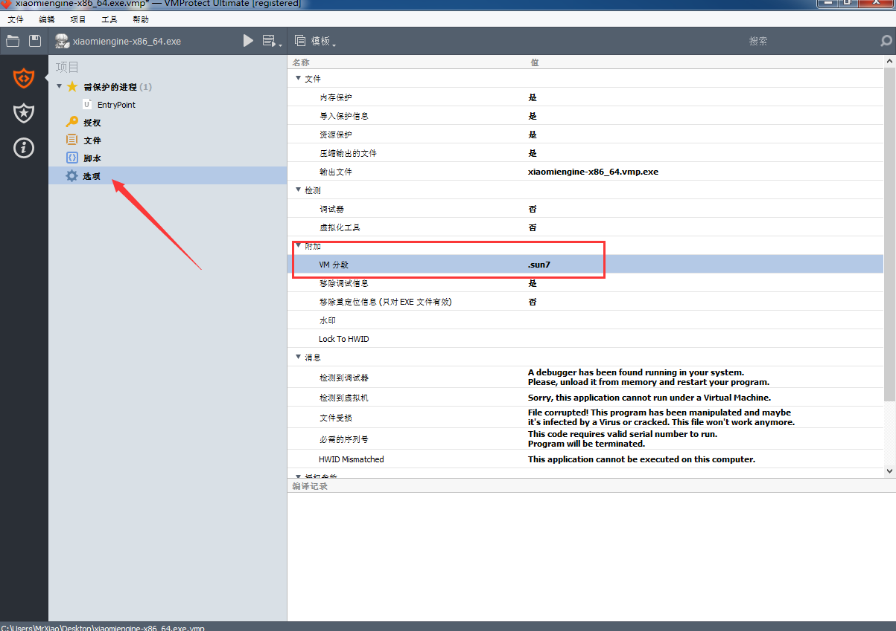
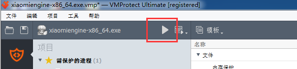
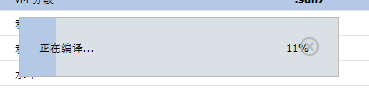
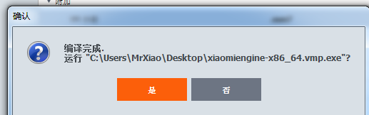
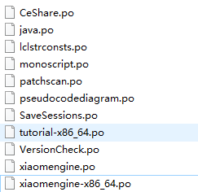
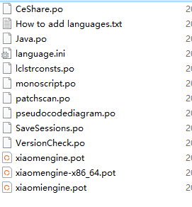

### 加壳与汉化

​	我们现在把CE特征也抹除了，游戏也能正常调试了，但是还不够，我们最好是给我们的CE加个强壳，这样游戏更难检测到我们

我们运行我们的VMP加壳工具

点打开，打开我们编译出来的CE

点添加进程

选中我们的entrypoint然后点选项

编译类型自己选一个

选好后点添加进程即可

然后点选项 给VM分段改个名字(非必要)

然后点上面的三角形

已经开始编译了

经过漫长的等待总算成功了

### 汉化

现在我们的CE还是英文的，如果要汉化的话

进入 cheat-engine-master\Cheat Engine\bin\languages 文件夹

把CheatEngine.pot改为xiaomengine-x86_64.pot

进入 cheat-engine-master\Cheat Engine\bin\languages\zh_CN 文件夹

把CheatEngine.po改为xiaomengine-x86_64.po 和xiaomengine.po

如下：

打开cheat-engine-master\Cheat Engine\bin\languages\language.ini文件把PreferedLanguage=*改为PreferedLanguage=zh_cn